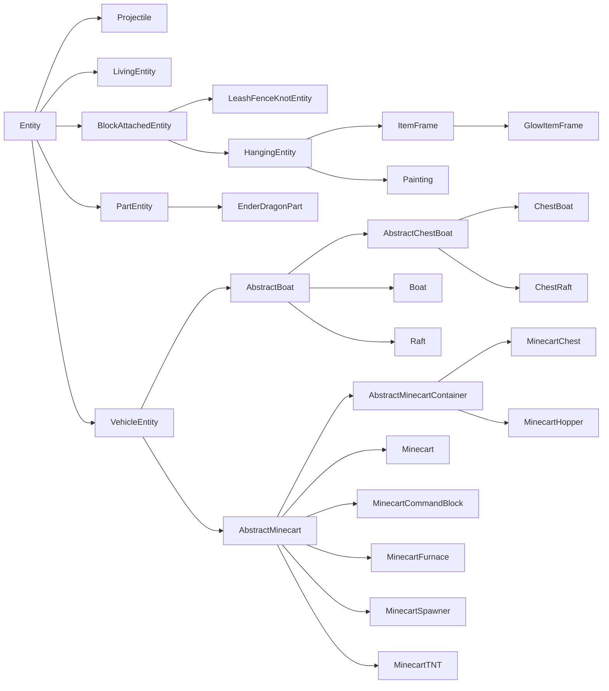
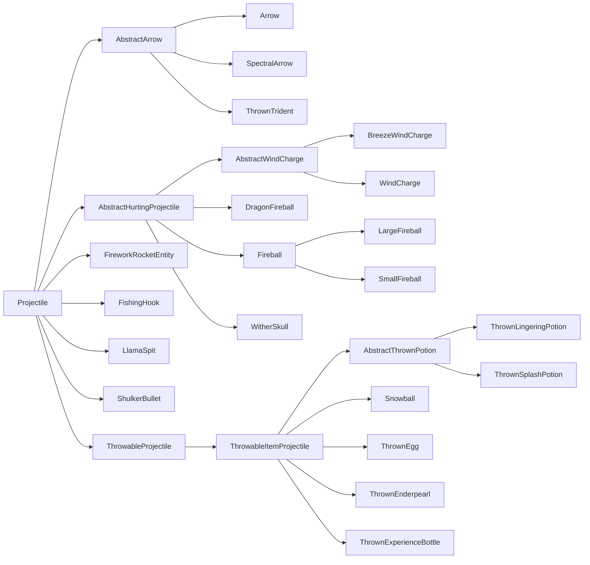
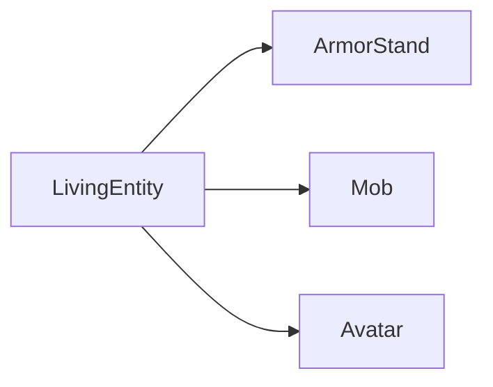
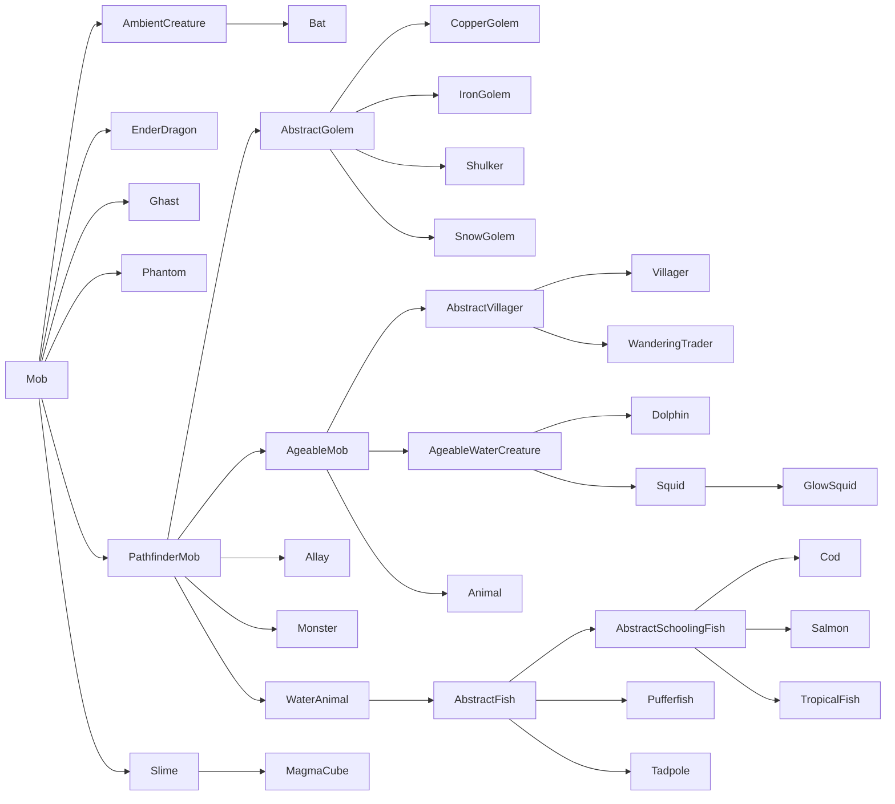
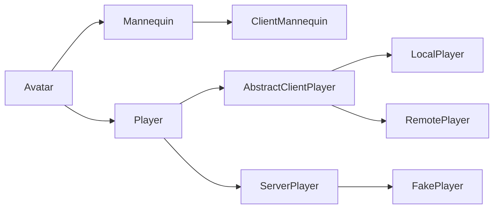
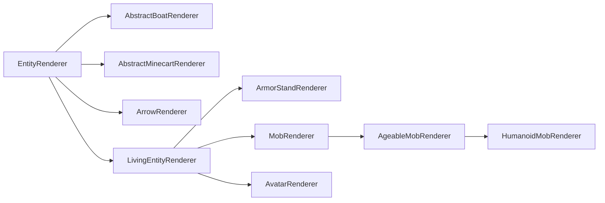

# NeoForge 实体

> 来源:neoforged/Documentation 官方文档(英文原文,API 名与代码签名原样保留)。
> 回答时用中文解释,类名/方法名保持英文。

## entities/attributes

---
sidebar_position: 4
---
# Attributes

Attributes are special fields of [living entities][livingentity] that determine basic properties such as max health, speed or armor. All attributes are stored as double values and synced automatically. Vanilla offers a wide range of default attributes, and you can also add your own.

Due to legacy implementations, not all attributes work with all entities. For example, flying speed is ignored by ghasts, and jump strength only affects horses, not players.

## Built-In Attributes

### Minecraft

The following attributes are in the `minecraft` namespace, and their in-code values can be found in the `Attributes` class.

| Name                             | In Code                          | Range          | Default Value | Usage                                                                                                                                                                 |
|----------------------------------|----------------------------------|----------------|---------------|-----------------------------------------------------------------------------------------------------------------------------------------------------------------------|
| `armor`                          | `ARMOR`                          | `[0,30]`       | 0             | The armor value of the entity. A value of 1 means half a chestplate icon above the hotbar.                                                                            |
| `armor_toughness`                | `ARMOR_TOUGHNESS`                | `[0,20]`       | 0             | The armor toughness value of the entity. See [Armor Toughness][toughness] on the [Minecraft Wiki][wiki] for more information.                                         |
| `attack_damage`                  | `ATTACK_DAMAGE`                  | `[0,2048]`     | 2             | The base attack damage done by the entity, without any weapon or similar item.                                                                                        |
| `attack_knockback`               | `ATTACK_KNOCKBACK`               | `[0,5]`        | 0             | The extra knockback dealt by the entity. Knockback additionally has a base strength not represented by this attribute.                                                |
| `attack_speed`                   | `ATTACK_SPEED`                   | `[0,1024]`     | 4             | The attack cooldown of the entity. Higher numbers mean more cooldown, setting this to 0 effectively re-enables pre-1.9 combat.                                        |
| `block_break_speed`              | `BLOCK_BREAK_SPEED`              | `[0,1024]`     | 1             | How fast the entity can mine blocks, as a multiplicative modifier. See [Mining Speed][miningspeed] for more information.                                              |
| `block_interaction_range`        | `BLOCK_INTERACTION_RANGE`        | `[0,64]`       | 4.5           | The interaction range in which the entity can interact with blocks, in blocks.                                                                                        |
| `burning_time`                   | `BURNING_TIME`                   | `[0,1024]`     | 1             | A multiplier for how long the entity will burn when ignited.                                                                                                          |
| `camera_distance`                | `CAMERA_DISTANCE`                | `[0,32]`       | 4             | The distance of the camera from the entity when in third person, including spectating or riding another entity.                                                        |
| `explosion_knockback_resistance` | `EXPLOSION_KNOCKBACK_RESISTANCE` | `[0,1]`        | 0             | The explosion knockback resistance of the entity. This is a value in percent, i.e. 0 is no resistance, 0.5 is half resistance, and 1 is full resistance.              |
| `entity_interaction_range`       | `ENTITY_INTERACTION_RANGE`       | `[0,64]`       | 3             | The interaction range in which the entity can interact with other entities, in blocks.                                                                                |
| `fall_damage_multiplier`         | `FALL_DAMAGE_MULTIPLIER`         | `[0,100]`      | 1             | A multiplier for fall damage taken by the entity.                                                                                                                     |
| `flying_speed`                   | `FLYING_SPEED`                   | `[0,1024]`     | 0.4           | A multiplier for flying speed. This is not actually used by all flying entities, and ignored by e.g. ghasts.                                                          |
| `follow_range`                   | `FOLLOW_RANGE`                   | `[0,2048]`     | 32            | The distance in blocks that the entity will target/follow the player.                                                                                                 |
| `gravity`                        | `GRAVITY`                        | `[1,1]`        | 0.08          | The gravity the entity is influenced by, in blocks per tick squared.                                                                                                  |
| `jump_strength`                  | `JUMP_STRENGTH`                  | `[0,32]`       | 0.42          | The jump strength of the entity. Higher value means higher jumping.                                                                                                   |
| `knockback_resistance`           | `KNOCKBACK_RESISTANCE`           | `[0,1]`        | 0             | The knockback resistance of the entity. This is a value in percent, i.e. 0 is no resistance, 0.5 is half resistance, and 1 is full resistance.                        |
| `luck`                           | `LUCK`                           | `[-1024,1024]` | 0             | The luck value of the entity. This is used when rolling [loot tables][loottables] to give bonus rolls or otherwise modify the resulting items' quality.               |
| `max_absorption`                 | `MAX_ABSORPTION`                 | `[0,2048]`     | 0             | The max absorption (yellow hearts) of the entity. A value of 1 means half a heart.                                                                                    |
| `max_health`                     | `MAX_HEALTH`                     | `[1,1024]`     | 20            | The max health of the entity. A value of 1 means half a heart.                                                                                                        |
| `mining_efficiency`              | `MINING_EFFICIENCY`              | `[0,1024]`     | 0             | How fast the entity can mine blocks, as an additive modifier, only if the used tool is correct. See [Mining Speed][miningspeed] for more information.                 |
| `movement_efficiency`            | `MOVEMENT_EFFICIENCY`            | `[0,1]`        | 0             | A linearly-interpolated movement speed bonus applied to the entity when it is walking on blocks that have a slowdown, such as soul sand.                              |
| `movement_speed`                 | `MOVEMENT_SPEED`                 | `[0,1024]`     | 0.7           | The movement speed of the entity. Higher value means faster.                                                                                                          |
| `oxygen_bonus`                   | `OXYGEN_BONUS`                   | `[0,1024]`     | 0             | An oxygen bonus for the entity. The higher this is, the longer it takes for the entity to start drowning.                                                             |
| `safe_fall_distance`             | `SAFE_FALL_DISTANCE`             | `[-1024,1024]` | 3             | The fall distance for the entity that is safe, i.e. the distance in which no fall damage is taken.                                                                    |
| `scale`                          | `SCALE`                          | `[0.0625,16]`  | 1             | The scale at which the entity is rendered.                                                                                                                            |
| `sneaking_speed`                 | `SNEAKING_SPEED`                 | `[0,1]`        | 0.3           | A movement speed multiplier applied to the entity when it is sneaking.                                                                                                |
| `spawn_reinforcements`           | `SPAWN_REINFORCEMENTS_CHANCE`    | `[0,1]`        | 0             | The chance for zombies to spawn other zombies. This is only relevant on hard difficulty, as zombie reinforcements do not occur on normal difficulty or lower.         |
| `step_height`                    | `STEP_HEIGHT`                    | `[0,10]`       | 0.6           | The step height of the entity, in blocks. If this is 1, the player can walk up 1-block ledges like they were slabs.                                                   |
| `submerged_mining_speed`         | `SUBMERGED_MINING_SPEED`         | `[0,20]`       | 0.2           | How fast the entity can mine blocks, as a multiplicative modifier, only if the entity is underwater. See [Mining Speed][miningspeed] for more information.            |
| `sweeping_damage_ratio`          | `SWEEPING_DAMAGE_RATIO`          | `[0,1]`        | 0             | The amount of damage done by sweep attacks, in percent of the main attack. This is a value in percent, i.e. 0 is no damage, 0.5 is half damage, and 1 is full damage. |
| `tempt_range`                    | `TEMPT_RANGE`                    | `[0,2048]`     | 10            | The range at which the entity can be tempted using items. Mainly for passive animals, e.g. cows or pigs.                                                              |
| `water_movement_efficiency`      | `WATER_MOVEMENT_EFFICIENCY`      | `[0,1]`        | 0             | A movement speed multiplier that is applied when the entity is underwater.                                                                                            |
| `waypoint_transmit_range`        | `WAYPOINT_TRANSMIT_RANGE`        | `[0,60000000]` | 0             | The range at which an entity can transmit its location to some waypoint tracker. |
| `waypoint_receive_range`         | `WAYPOINT_RECEIVE_RANGE`         | `[0,60000000]` | 0             | The range at which an entity can receive another transmitter.                    |

:::warning
Some attribute caps are set relatively arbitrarily by Mojang. This is especially notable for armor, which is capped at 30. NeoForge doesn't touch those caps, however there are mods to change them.
:::

### NeoForge

The following attributes are in the `neoforge` namespace, and their in-code values can be found in the `NeoForgeMod` class.

| Name               | In Code            | Range      | Default Value | Usage                                                                                                                                                |
|--------------------|--------------------|------------|---------------|------------------------------------------------------------------------------------------------------------------------------------------------------|
| `creative_flight`  | `CREATIVE_FLIGHT`  | `[0,1]`    | 0             | Determines whether creative flight for the entity is enabled (\> 0) or disabled (\<\= 0).                                                            |
| `nametag_distance` | `NAMETAG_DISTANCE` | `[0,32]`   | 32            | How far the nametag of the entity will be visible, in blocks.                                                                                        |
| `swim_speed`       | `SWIM_SPEED`       | `[0,1024]` | 1             | A movement speed multiplier that is applied when the entity is underwater. This is applied independently from `minecraft:water_movement_efficiency`. |

## Default Attributes

When creating a `LivingEntity`, it is required to register a set of default attributes for them. When an entity is [spawned][spawning] in, its default attributes are set on it. Default attributes are registered in the [`EntityAttributeCreationEvent`][event] like so:

```java
@SubscribeEvent // on the mod event bus
public static void createDefaultAttributes(EntityAttributeCreationEvent event) {
    event.put(
        // Your entity type.
        MY_ENTITY.get(),
        // An AttributeSupplier. This is typically created by calling LivingEntity#createLivingAttributes,
        // setting your values on it, and calling #build. You can also create the AttributeSupplier from scratch
        // if you want, see the source of LivingEntity#createLivingAttributes for an example.
        LivingEntity.createLivingAttributes()
            // Add an attribute with its default value.
            .add(Attributes.MAX_HEALTH)
            // Add an attribute with a non-default value.
            .add(Attributes.MAX_HEALTH, 50)
            // Build the AttributeSupplier.
            .build()
    );
}
```

:::tip
Some classes have specialized versions of `LivingEntity#createLivingAttributes`. For example, the `Monster` class has a method named `Monster#createMonsterAttributes` that can be used instead.
:::

In some situations, for example when making [your own attributes][custom], it is needed to add attributes to an existing entity's `AttributeSupplier`. This is done through the `EntityAttributeModificationEvent` like so:

```java
@SubscribeEvent // on the mod event bus
public static void modifyDefaultAttributes(EntityAttributeModificationEvent event) {
    event.add(
        // The EntityType to add the attribute for.
        EntityType.VILLAGER,
        // The Holder<Attribute> to add to the EntityType. Can also be a custom attribute.
        Attributes.ARMOR,
        // The attribute value to add.
        // Can be omitted, if so, the attribute's default value will be used instead.
        10.0
    );
    // We can also check if a given EntityType already has a given attribute.
    // In this example, if villagers don't have the armor attribute already, we add it.
    if (!event.has(EntityType.VILLAGER, Attributes.ARMOR)) {
        event.add(...);
    }
}
```

Be aware that unlike some other registries, custom attributes existing do not block vanilla clients from connecting to a NeoForge server. If a vanilla client connects, it will only receive the attributes in the `minecraft` namespace.

## Querying Attributes

Attribute values are stored on entities in an `AttributeMap`, which is basically a `Map<Attribute, AttributeInstance>`. Attribute instances are basically what item stacks are to items, i.e. whereas an attribute is a registered singleton, attribute instances are concrete attribute objects bound to a concrete entity.

The `AttributeMap` of an entity can be retrieved by calling `LivingEntity#getAttributes`. You can then query the map like so:

```java
// Get the attribute map.
AttributeMap attributes = livingEntity.getAttributes();
// Get an attribute instance. This may be null if the entity does not have the attribute.
AttributeInstance instance = attributes.getInstance(Attributes.ARMOR);
// Get the value for an attribute. Will fallback to the default for the entity if needed.
double value = attributes.getValue(Attributes.ARMOR);
// Of course, we can also check if an attribute is present to begin with.
if (attributes.hasAttribute(Attributes.ARMOR)) { ... }

// Alternatively, LivingEntity also offers shortcuts:
AttributeInstance instance = livingEntity.getAttribute(Attributes.ARMOR);
double value = livingEntity.getAttributeValue(Attributes.ARMOR);
```

:::info
When handling attributes, you will almost exclusively use `Holder<Attribute>`s instead of `Attribute`s. This is also why with custom attributes (see below), we explicitly store the `Holder<Attribute>`.
:::

## Attribute Modifiers

In contrast to querying, changing the attribute values is not as easy. This is mainly because there may be multiple changes required to an attribute at the same time.

Consider this: You are a player, who has an attack damage attribute of 1. You wield a diamond sword, which does 6 extra attack damage, so you have 7 total attack damage. Then you drink a strength potion, adding a damage multiplier. You then also have some sort of trinket equipped that adds yet another multiplier.

To avoid miscalculations and to better communicate how the attribute values are modified, Minecraft introduces the attribute modifier system. In this system, every attribute has a **base value**, which is typically sourced from the default attributes we discussed earlier. We can then add any amount of **attribute modifiers** that can be individually removed again, without us having to worry about correctly applying operations.

To get started, let's create an attribute modifier:

```java
// The name of the modifier. This is later used to query the modifier from the attribute map
// and as such must be (semantically) unique.
Identifier id = Identifier.fromNamespaceAndPath("yourmodid", "my_modifier");
// The modifier itself.
AttributeModifier modifier = new AttributeModifier(
    // The name we defined earlier.
    id,
    // The amount by which we modify the attribute value.
    2.0,
    // The operation used to apply the modifier. Possible values are:
    // - AttributeModifier.Operation.ADD_VALUE: Adds the value to the total attribute value.
    // - AttributeModifier.Operation.ADD_MULTIPLIED_BASE: Multiplies the value with the attribute base value
    //   and adds it to the total attribute value.
    // - AttributeModifier.Operation.ADD_MULTIPLIED_TOTAL: Multiplies the value with the total attribute value,
    //   i.e. the attribute base value with all previous modifications already performed,
    //   and adds it to the total attribute value.
    AttributeModifier.Operation.ADD_VALUE
);
```

Now, to apply the modifier, we have two options: add it as a transient modifier, or as a permanent modifier. Permanent modifiers are saved to disk, while transient modifiers are not. The use case for permanent modifiers is things like permanent stat bonuses (e.g. some sort of armor or health skill), while transient modifiers are mainly for [equipment], [mob effects][mobeffect] and other modifiers that depend on the player's current state.

```java
AttributeMap attributes = livingEntity.getAttributes();
// Add a transient modifier. If a modifier with the same id is already present, this will throw an exception.
attributes.getInstance(Attributes.ARMOR).addTransientModifier(modifier);
// Add a transient modifier. If a modifier with the same id is already present, it is removed first.
attributes.getInstance(Attributes.ARMOR).addOrUpdateTransientModifier(modifier);
// Add a permanent modifier. If a modifier with the same id is already present, this will throw an exception.
attributes.getInstance(Attributes.ARMOR).addPermanentModifier(modifier);
// Add a permanent modifier. If a modifier with the same id is already present, it is removed first.
attributes.getInstance(Attributes.ARMOR).addOrReplacePermanentModifier(modifier);
```

These modifiers can also be removed again:

```java
// Remove by modifier object.
attributes.getInstance(Attributes.ARMOR).removeModifier(modifier);
// Remove by modifier id.
attributes.getInstance(Attributes.ARMOR).removeModifier(id);
// Remove all modifiers for an attribute.
attributes.getInstance(Attributes.ARMOR).removeModifiers();
```

Finally, we can also query the attribute map for whether it has a modifier with a certain ID, as well as query base values and modifier values separately, like so:

```java
// Check for the modifier being present.
if (attributes.getInstance(Attributes.ARMOR).hasModifier(id)) { ... }
// Get the base armor attribute value.
double baseValue = attributes.getBaseValue(Attributes.ARMOR);
// Get the value of a certain modifier.
double modifierValue = attributes.getModifierValue(Attributes.ARMOR, id);
```

## Custom Attributes

If needed, you can also add your own attributes. Like many other systems, attributes are a [registry], and you can register your own objects to it. To get started, create a `DeferredRegister<Attribute>` like so:

```java
public static final DeferredRegister<Attribute> ATTRIBUTES = DeferredRegister.create(
    BuiltInRegistries.ATTRIBUTE, "yourmodid");
```

For the attributes themselves, there are three classes you can choose from:

- `RangedAttribute`: Used by most attributes, this class defines lower and upper bounds for the attribute, along with a default value.
- `PercentageAttribute`: Like `RangedAttribute`, but is displayed in percent instead of float values. NeoForge-added.
- `BooleanAttribute`: An attribute that only has semantic true (\> 0) and false (\<\= 0). This still uses doubles internally. NeoForge-added.

Using `RangedAttribute` as an example (the other two work similarly), registering an attribute would look like this:

```java
public static final Holder<Attribute> MY_ATTRIBUTE = ATTRIBUTES.register("my_attribute", () -> new RangedAttribute(
    // The translation key to use.
    "attributes.yourmodid.my_attribute",
    // The default value.
    0,
    // Min and max values.
    -10000,
    10000
));
```

And that's it! Just don't forget to register your `DeferredRegister` to the mod bus, and off you go.

:::info
We use `Holder<Attribute>` here instead of `Supplier<RangedAttribute>` like with many other registered objects, as it makes working with entities a lot easier (most entity methods expect `Holder<Attribute>`s).

If, for some reason, you need a `Supplier<RangedAttribute>` (or a supplier of any other subclass of `Attribute`), you should use `DeferredHolder<Attribute, RangedAttribute>` as the type.

The same rules also apply for any other `Attribute` subclass, i.e., we generally use `Holder<Attribute>` instead of `Supplier<PercentageAttribute>` or `Supplier<BooleanAttribute>`.
:::

[custom]: #custom-attributes
[equipment]: ../inventories/container.md#containers-on-entitys
[event]: ../concepts/events.md
[livingentity]: livingentity.md
[loottables]: ../resources/server/loottables/index.md
[miningspeed]: ../blocks/index.md#mining-speed
[mobeffect]: ../items/mobeffects.md
[registry]: ../concepts/registries.md
[spawning]: index.md#spawning-entities
[toughness]: https://minecraft.wiki/w/Armor#Armor_toughness
[wiki]: https://minecraft.wiki

## entities/data

---
sidebar_position: 2
---
# Data and Networking

An entity without data is quite useless, as such, storing data on an entity is essential. All entities store some default data, such as their type and their position. This article will explain how to add your own data, as well as how to synchronize that data.

The most simple way to add data is as a field in your `Entity` class. You can then interact with this data in any way you wish. However, this quickly becomes very annoying as soon as you have to synchronize that data. This is because most entity logic is run on the server only, and it is only occasionally (depending on the [`EntityType`][entitytype]'s `clientUpdateInterval` value) that an update is sent to the client; this is also the cause for easily noticeable entity "lags" when the server's tick speed is too slow.

As such, vanilla introduces a few systems to help with that, each of which serves a specific purpose. You also always have the option of [sending custom data][custom] when necessary.

## `SynchedEntityData`

`SynchedEntityData` is a system used for storing values at runtime and syncing them over the network. It is split into three classes:

- `EntityDataSerializer`s are basically wrappers around a [`StreamCodec`][streamcodec].
    - Minecraft uses a hard-coded map of serializers. NeoForge transforms this map into a registry, meaning that if you want to add new `EntityDataSerializer`s, they must be added by [registration].
    - Minecraft defines various default `EntityDataSerializer`s in the `EntityDataSerializers` class.
- `EntityDataAccessor`s are held by the entity and are used to get and set the data values.
- `SynchedEntityData` itself holds all `EntityDataAccessor`s for an entity, and automatically calls on the `EntityDataSerializer`s to sync values as needed.

To get started, create an `EntityDataAccessor` in your entity class:

```java
public class MyEntity extends Entity {
    // The generic type must match the one of the second parameter below.
    public static final EntityDataAccessor<Integer> MY_DATA =
        SynchedEntityData.defineId(
            // The class of the entity.
            MyEntity.class,
            // The entity data accessor type.
            EntityDataSerializers.INT
        );
}
```

:::danger
While the compiler will allow you to use a class other than the owning class as the first parameter in `SynchedEntityData#defineId()`, doing so can and will lead to hard-to-debug issues and, as such, is to be avoided at all costs. (This also includes adding fields via mixins or similar methods.)
:::

We must then define default values in the `defineSynchedData` method, like so:

```java
public class MyEntity extends Entity {
    public static final EntityDataAccessor<Integer> MY_DATA = SynchedEntityData.defineId(MyEntity.class, EntityDataSerializers.INT);

    @Override
    protected void defineSynchedData(SynchedEntityData.Builder builder) {
        // Our default value is zero.
        builder.define(MY_DATA, 0);
    }
}
```

Finally, we can get and set entity data like so (assuming we're in a method within `MyEntity`):

```java
int data = this.getEntityData().get(MY_DATA);
this.getEntityData().set(MY_DATA, 1);
```

## `readAdditionalSaveData` and `addAdditionalSaveData`

These two methods are used to read and write data to disk. They work by loading/saving your values from/to a [value I/O][valueio], like so:

```java
// Assume that an `int data` exists in the class.
@Override
protected void readAdditionalSaveData(ValueInput input) {
    this.data = input.getIntOr("my_data", 0);
}

@Override
protected void addAdditionalSaveData(ValueOutput output) {
    output.putInt("my_data", this.data);
}
```

## Custom Spawn Data

In some cases, there is custom data needed for your entity on the client when it is spawned, but that same data doesn't change over time. When this is the case, you can implement the `IEntityWithComplexSpawn` interface on your entity and use its two methods `#writeSpawnData` and `#readSpawnData` to write/read data to/from the network buffer:

```java
@Override
public void writeSpawnData(RegistryFriendlyByteBuf buf) {
    buf.writeInt(1234);
}

@Override
public void readSpawnData(RegistryFriendlyByteBuf buf) {
    int i = buf.readInt();
}
```

Additionally, you can send your own packets upon spawning. To do so, override `IEntityExtension#sendPairingData` and send your packets there like any other packet:

```java
@Override
public void sendPairingData(ServerPlayer player, Consumer<CustomPacketPayload> packetConsumer) {
    // Call super for some base functionality.
    super.sendPairingData(player, packetConsumer);
    // Add your own packets.
    packetConsumer.accept(new MyPacket(...));
}
```

Please refer to the [Networking articles][networking] for more information on custom network packets.

## Data Attachments

Entities have been patched to extend `AttachmentHolder` and as such support data storage via [data attachments][attachment]. Its main use is to define custom data on entities that are not your own, i.e., entities added by Minecraft or other mods. Please see the linked article for more information.

## Custom Network Messages

For syncing, you can also always opt to use a custom packet to send additional information when needed. Please refer to the [Networking articles][networking] for more information.

[attachment]: ../datastorage/attachments.md
[custom]: #custom-network-messages
[entitytype]: index.md#entitytype
[networking]: ../networking/index.md
[registration]: ../concepts/registries.md#methods-for-registering
[streamcodec]: ../networking/streamcodecs.md
[valueio]: ../datastorage/valueio.md

## entities/index

---
sidebar_position: 1
---
# Entities

Entities are in-world objects that can interact with the world in a variety of ways. Common example include mobs, projectiles, rideable objects, and even players. Each entity consists of multiple systems that may not seem understandable at first glance. This section will break down some of the key components related to constructing an entity and making it behave as the modder intends.

## Terminology

A simple entity is made up of three parts:

- The [`Entity`][entity] subclass, which holds most of our entity's logic
- The [`EntityType`][type], which is [registered][registration] and holds some common properties, and
- The [`EntityRenderer`][renderer], which is responsible for displaying the entity in-game

More complex entities may require more parts. For example, many of the more complex `EntityRenderer`s use an underlying `EntityModel` instance. Or, a naturally spawning entity will need some sort of [spawn mechanism][spawning].

## `EntityType`

The relationship between `EntityType`s and `Entity`s is similar to that of [`Item`s][item] and [`ItemStack`s][itemstack]. Like `Item`s, `EntityType`s are singletons that are registered to their corresponding registry (the entity type registry) and hold some values common to all entities of that type, while `Entity`s, like `ItemStack`s, are "instances" of that singleton type that hold data specific to that one entity instance. However, the key difference here is that most of the behavior is not defined in the singleton `EntityType`, but rather in the instantiated `Entity` class itself.

Let's create our `EntityType` registry and register an `EntityType` for it, assuming we have a class `MyEntity` that extends `Entity` (see [below][entity] for more information). All methods on `EntityType.Builder`, except for the `#build` call at the end, are optional.

```java
public static final DeferredRegister.Entities ENTITY_TYPES =
    DeferredRegister.createEntities(ExampleMod.MOD_ID);

public static final Supplier<EntityType<MyEntity>> MY_ENTITY = ENTITY_TYPES.register(
    "my_entity",
    // The entity type, created using a builder.
    () -> EntityType.Builder.of(
        // An EntityType.EntityFactory<T>, where T is the entity class used - MyEntity in this case.
        // You can think of it as a BiFunction<EntityType<T>, Level, T>.
        // This is commonly a reference to the entity constructor.
        MyEntity::new,
        // The MobCategory our entity uses. This is mainly relevant for spawning.
        // See below for more information.
        MobCategory.MISC
    )
    // The width and height, in blocks. The width is used in both horizontal directions.
    // This also means that non-square footprints are not supported. Default is 0.6f and 1.8f.
    .sized(1.0f, 1.0f)
    // A multiplicative factor (scalar) used by mobs that spawn in varying sizes.
    // In vanilla, these are only slimes and magma cubes, both of which use 4.0f.
    .spawnDimensionsScale(4.0f)
    // The eye height, in blocks from the bottom of the size. Defaults to height * 0.85.
    // This must be called after #sized to have an effect.
    .eyeHeight(0.5f)
    // Disables the entity being summonable via /summon.
    .noSummon()
    // Prevents the entity from being saved to disk.
    .noSave()
    // Makes the entity fire immune.
    .fireImmune()
    // Makes the entity immune to damage from a certain block. Vanilla uses this to make
    // foxes immune to sweet berry bushes, withers and wither skeletons immune to wither roses,
    // and polar bears, snow golems and strays immune to powder snow.
    .immuneTo(Blocks.POWDER_SNOW)
    // Disables a rule in the spawn handler that limits the distance at which entities can spawn.
    // This means that no matter the distance to the player, this entity can spawn.
    // Vanilla enables this for pillagers and shulkers.
    .canSpawnFarFromPlayer()
    // The range in which the entity is kept loaded by the client, in chunks.
    // Vanilla values for this vary, but it's often something around 8 or 10. Defaults to 5.
    // Be aware that if this is greater than the client's chunk view distance,
    // then that chunk view distance is effectively used here instead.
    .clientTrackingRange(8)
    // How often update packets are sent for this entity, in once every x ticks. This is set to higher values
    // for entities that have predictable movement patterns, for example projectiles. Defaults to 3.
    .updateInterval(10)
    // Build the entity type using a resource key. The second parameter should be the same as the entity id.
    .build(ResourceKey.create(
        Registries.ENTITY_TYPE,
        Identifier.fromNamespaceAndPath("examplemod", "my_entity")
    ))
);

// Shorthand version to avoid boilerplate. The following call is the same as
// ENTITY_TYPES.register("my_entity", () -> EntityType.Builder.of(MyEntity::new, MobCategory.MISC).build(
//     ResourceKey.create(Registries.ENTITY_TYPE, Identifier.fromNamespaceAndPath("examplemod", "my_entity"))
// );
public static final Supplier<EntityType<MyEntity>> MY_ENTITY =
    ENTITY_TYPES.registerEntityType("my_entity", MyEntity::new, MobCategory.MISC);

// Shorthand version that still allows calling additional builder methods
// by supplying a UnaryOperator<EntityType.Builder> parameter.
public static final Supplier<EntityType<MyEntity>> MY_ENTITY = ENTITY_TYPES.registerEntityType(
    "my_entity", MyEntity::new, MobCategory.MISC,
    builder -> builder.sized(2.0f, 2.0f).eyeHeight(1.5f).updateInterval(5));
```

### `MobCategory`

_See also [Natural Spawning][mobspawn]._

An entity's `MobCategory` determines some properties for the entity, which are related to [spawning and despawning][mobspawn]. Vanilla adds a total of eight `MobCategory`s by default:

| Name                         | Spawn Cap | Examples                                                                                                                       |
|------------------------------|-----------|--------------------------------------------------------------------------------------------------------------------------------|
| `MONSTER`                    | 70        | Various monsters                                                                                                               |
| `CREATURE`                   | 10        | Various animals                                                                                                                |
| `AMBIENT`                    | 15        | Bats                                                                                                                           |
| `AXOLOTS`                    | 5         | Axolotls                                                                                                                       |
| `UNDERGROUND_WATER_CREATURE` | 5         | Glow Squids                                                                                                                    |
| `WATER_CREATURE`             | 5         | Squids, Dolphins                                                                                                               |
| `WATER_AMBIENT`              | 20        | Fish                                                                                                                           |
| `MISC`                       | N/A       | All non-living entities, e.g. projectiles; using this `MobCategory` will make the entity unable to be spawned naturally at all |

There are also some other properties that are only set on one or two `MobCategory`s each:

- `isFriendly`: Set to false for `MONSTER`, and true for all others.
- `isPersistent`: Set to true for `CREATURE` and `MISC`, and false for all others.
- `despawnDistance`: Set to 64 for `WATER_AMBIENT`, and 128 for all others.

:::info
`MobCategory` is an [extensible enum][extenum], meaning that you can add custom entries to it. If you do so, you will also have to add some spawning mechanism for entities of this custom `MobCategory`.
:::

## The Entity Class

To begin, we create an `Entity` subclass. Alongside a constructor, `Entity` (which is an abstract class) defines four required methods that we are required to implement. The first three will be explained in the [Data and Networking article][data], in order to not further bloat this article, and `#hurtServer` is explained in the [Damaging Entities section][damaging].

```java
public class MyEntity extends Entity {
    // We inherit this constructor without the bound on the generic wildcard.
    // The bound is needed for registration below, so we add it here.
    public MyEntity(EntityType<? extends MyEntity> type, Level level) {
        super(type, level);
    }

    // See the Data and Networking article for information about these methods.
    @Override
    protected void readAdditionalSaveData(ValueInput input) {}

    @Override
    protected void addAdditionalSaveData(ValueOutput output) {}

    @Override
    protected void defineSynchedData(SynchedEntityData.Builder builder) {}

    @Override
    public boolean hurtServer(ServerLevel level, DamageSource damageSource, float amount) {
        return true;
    }
}
```

:::info
While `Entity` can be extended directly, it often makes sense to use one of its many subclasses as a base instead. See the [entity class hierarchy][hierarchy] for more information.
:::

If required (e.g. because you're spawning entities from code), you can also add custom constructors. These generally hardcode the entity type as a reference to the registered object, like so:

```java
public MyEntity(EntityType<? extends MyEntity> type, Level level, double x, double y, double z) {
    // Delegates to the factory constructor, using the EntityType we registered before.
    this(type, level);
    this.setPos(x, y, z);
}
```

:::warning
Custom constructors should never have exactly two parameters, as that will cause confusion with the `(EntityType, Level)` constructor above.
:::

And now, we are free to do basically whatever we want with our entity. The following subsections will display a variety of common entity use cases.

### Data Storage on Entities

_See [Entities/Data and Networking][data]._

### Rendering Entities

_See [Entities/Entity Renderers][renderer]._

### Spawning Entities

If we now boot up the game now and enter a world, we have exactly one way of spawning: through the [`/summon`][summon] command (assuming `EntityType.Builder#noSummon` was not called).

Obviously, we want to add our entities some other way. The easiest way to do so is through the `LevelWriter#addFreshEntity` method. This method simply accepts an `Entity` instance and adds it to the world, like so:

```java
// In some method that has a level available, only on the server
if (!level.isClientSide()) {
    MyEntity entity = new MyEntity(level, 100.0, 200.0, 300.0);
    level.addFreshEntity(entity);
}
```

Alternatively, you can also call `EntityType#spawn`, which is especially recommended when spawning [living entities][livingentity], as it does some additional setup, such as firing the spawn [events][event].

This will be used for pretty much all non-living entities. Players should obviously not be spawned yourself, `Mob`s have [their own ways of spawning][mobspawn] (though they can also be added via `#addFreshEntity`), and vanilla [projectiles][projectile] also have static helpers for spawning in the `Projectile` class.

### Damaging Entities

_See also [Left-Clicking an Item][leftclick]._

While not all entities have the concept of hit points, they can still all receive damage. This is not only used by things like mobs and players: If you cast your mind to item entities (dropped items), they too can take damage from sources like fire or cacti, in which case they are usually deleted immediately.

Damaging an entity is possible by calling either `Entity#hurt` or `Entity#hurtOrSimulate`, the difference between those two is explained below. Both methods take two arguments: the [`DamageSource`][damagesource] and the damage amount, as a float in half hearts. For example, calling `entity.hurt(entity.damageSources().wither(), 4.25)` will cause a little over two hearts of wither damage.

In turn, entities can also modify that behavior. This isn't done by overriding `#hurt`, as it is a final method. Rather, there are two methods `#hurtServer` and `#hurtClient` that each handle damage logic for the corresponding side. `#hurtClient` is commonly used to tell the client that an attack has succeeded, even though that may not always be true, mainly for playing attack sounds and other effects regardless. For changing damage behavior, we mainly care about `#hurtServer`, which we can override like so:

```java
@Override
// The boolean return value determines whether the entity was actually damaged or not.
public boolean hurtServer(ServerLevel level, DamageSource damageSource, float amount) {
    if (damageSource.is(DamageTypeTags.IS_FIRE)) {
        // This assumes that super#hurtServer() is implemented. Common other ways to do this
        // are to set some field yourself. Vanilla implementations vary greatly across different entities.
        // Notably, living entities usually call #actuallyHurt, which in turn calls #setHealth.
        return super.hurtServer(level, damageSource, amount * 2);
    } else {
        return false;
    }
}
```

This server/client separation is also the difference between `Entity#hurt` and `Entity#hurtOrSimulate`: `Entity#hurt` only runs on the server (and calls `Entity#hurtServer`), whereas `Entity#hurtOrSimulate` runs on both sides, calling `Entity#hurtServer` or `Entity#hurtClient` depending on the side.

It is also possible to modify damage done to entities that do not belong to you, i.e. those added by Minecraft or other mods, through events. These events contain a lot of code specific to `LivingEntity`s; as such, their documentation resides in the [Damage Events section][damageevents] within the [Living Entities article][livingentity].

### Ticking Entities

Quite often, you will want your entity to do something (e.g. move) every tick. This logic is split across several methods:

- `#tick`: This is the central tick method, and the one you will want to override in 99% of cases.
    - By default, this forwards to `#baseTick`, however this is overridden by almost every subclass.
- `#baseTick`: This method handles updating some values common to all entities, including the "on fire" state, freezing from powder snow, the swimming state, and passing through portals. `LivingEntity` additionally handles drowning, in-block damage, and updates to the damage tracker here. Override this method if you want to change or add to that logic.
    - By default, `Entity#tick` will forward to this method.
- `#rideTick`: This method is called for passengers of other entities, for example for players riding horses, or any entity that rides another entity due to use of the `/ride` command.
    - By default, this does some checks and then calls `#tick`. Skeletons and players override this method for special handling of riding entities.

Additionally, the entity has a field called `tickCount`, which is the time, in ticks, that the entity has existed in the level, and a boolean field named `firstTick`, which should be self-explanatory. For example, if you wanted to [spawn a particle][particle] every 5 ticks, you could use the following code:

```java
@Override
public void tick() {
    // Always call super unless you have a good reason not to.
    super.tick();
    // Run this code once every 5 ticks.
    if (this.tickCount % 5 == 0) {
        this.level().addParticle(...);
    }
}
```

### Picking Entities

_See also [Middle-Clicking][middleclick]._

Picking is the process of selecting the thing that the player is currently looking at, as well as subsequently picking the associated item. The result of middle-clicking, known as the "pick result", can be modified by your entity (be aware that the `Mob` class will select the correct spawn egg for you):

```java
@Override
@Nullable
public ItemStack getPickResult() {
    // Assumes that MY_CUSTOM_ITEM is a DeferredItem<?>, see the Items article for more information.
    // If the entity should not be pickable, it is advised to return null here.
    return new ItemStack(MY_CUSTOM_ITEM.get());
}
```

While entities should generally be pickable, there are some niche cases where this isn't desirable. A vanilla use case for this is the ender dragon, which consists of multiple parts. The parent entity has picking disabled, but the parts have it enabled again, for finer hitbox tuning.

If you have a similarly niche use case, your entity can also be disabled from picking entirely like so:

```java
@Override
public boolean isPickable() {
    // Additional checks may be performed here if needed.
    return false;
}
```

If you want to do the picking (i.e. ray casting) yourself, you can call `Entity#pick` on the entity that you want to start the ray cast from. This will return a [`HitResult`][hitresult] that you can further check for what exactly has been hit by the ray cast.

### Entity Attachments

_Not to be confused with [Data Attachments][dataattachments]._

Entity attachments are used to define visual attachment points for the entity. Using this system, it can be defined where things like passengers or name tags will be displayed relative to the entity itself. The entity itself controls only the default position of the attachment, and the attachment can then define an offset from that default.

When building the `EntityType`, any amount of attachment points can be set by calling `EntityType.Builder#attach`. This method accepts an `EntityAttachment`, which defines the attachment to consider, and three floats to define the position (x/y/z). The position should be defined relative to where the default value of the attachment would be.

Vanilla defines the following four `EntityAttachment`s:

| Name           | Default                                  | Usages                                                               |
|----------------|------------------------------------------|----------------------------------------------------------------------|
| `PASSENGER`    | Center X/top Y/center Z of the hitbox    | Rideable entities, e.g. horses, to define where passengers appear    |
| `VEHICLE`      | Center X/bottom Y/center Z of the hitbox | All entities, to define where they appear when riding another entity |
| `NAME_TAG`     | Center X/top Y/center Z of the hitbox    | Define where the name tag of the entity appears, if applicable       |
| `WARDEN_CHEST` | Center X/center Y/center Z of the hitbox | By wardens, to define where the sonic boom attack originates from    |

:::info
`PASSENGER` and `VEHICLE` are related in that they are used in the same context. First, `PASSENGER` is applied to position the rider. Then, `VEHICLE` is applied on the rider.
:::

Every attachment can be thought of as a mapping from `EntityAttachment` to `List<Vec3>`. The amount of points actually used depends on the consuming system. For example, boats and camels will use two `PASSENGER` points, while entities like horses or minecarts will only use one `PASSENGER` point.

`EntityType.Builder` also has some helpers related to `EntityAttachment`s:

- `#passengerAttachment()`: Used to define `PASSENGER` attachments. Comes in two variants.
    - One variant accepts a `Vec3...` of attachment points.
    - The other accepts a `float...`, which forwards to the `Vec3...` variant by transforming each float to a `Vec3` that uses the given float as the y value, and sets x and z to 0.
- `#vehicleAttachment()`: Used to define a `VEHICLE` attachment. Accepts a `Vec3`.
- `#ridingOffset()`: Used to define a `VEHICLE` attachment. Accepts a float and forwards to `#vehicleAttachment()` with a `Vec3` that has its x and z values set to 0, and the y value set to the negated value of the passed-in float.
- `#nameTagOffset()`: Used to define a `NAME_TAG` attachment. Accepts a float, which is used for the y value, with 0 being used for the x and z values.

Alternatively, attachments can be defined yourself by calling `EntityAttachments#builder()` and then calling `#attach()` on that builder, like so:

```java
// In some EntityType<?> creation
EntityType.Builder.of(...)
    // This EntityAttachment will make name tags float half a block above the ground.
    // If this is not set, it will default to the entity's hitbox height.
    .attach(EntityAttachment.NAME_TAG, 0, 0.5f, 0)
    .build();
```

## Entity Class Hierarchy

Due to the many different types of entities, there is a complex hierarchy of subclasses of `Entity`. These are important to know about when choosing what class to extend when making your own entity, as you will be able to save a lot of work by reusing their code.

The vanilla entity hierarchy looks like this (red classes are `abstract`, blue classes are not):



Let's break these down:

- `Projectile`: The base class for various projectiles, including arrows, fireballs, snowballs, fireworks and similar entities. Read more about them [below][projectile].
- `LivingEntity`: The base class for anything "living", in the sense of it having things like hit points, equipment, [mob effects][mobeffect] and some other properties. Includes things such as monsters, animals, villagers, and players. Read more about them in the [Living Entities article][livingentity].
- `BlockAttachedEntity`: The base class for entities that are immobile and attached to blocks. Includes leash knots, item frames and paintings. The subclasses mainly serve the purpose of reusing common code.
- `PartEntity`: A NeoForge-added base class for part entities, i.e. entities made up of multiple smaller entities. `EnderDragonPart` is patched to extend `PartEntity` instead of `Entity`.
- `VehicleEntity`: The base class for boats and minecarts. While these entities loosely share the concept of hit points with `LivingEntity`s, they do not share many other properties with them and are as such kept separated. The subclasses mainly serve the purpose of reusing common code.

There are also several entities that are direct subclasses of `Entity`, simply because there was no other fitting superclass. Most of these should be self-explanatory:

- `AreaEffectCloud` (lingering potion clouds)
- `EndCrystal`
- `EvokerFangs`
- `ExperienceOrb`
- `EyeOfEnder`
- `FallingBlockEntity` (falling sand, gravel etc.)
- `ItemEntity` (dropped items)
- `LightningBolt`
- `OminousItemSpawner` (for continuously spawning the loot of trial spawners)
- `PrimedTnt`

Not included in this diagram and list are the mapmaker entities (displays, interactions and markers).

### Projectiles

Projectiles are a subgroup of entities. Common to them is that they fly in one direction until they hit something, and that they have an owner assigned to them (e.g. a player or a skeleton would be the owner of an arrow, or a ghast would be the owner of a fireball).

The class hierarchy of projectiles looks as follows (red classes are `abstract`, blue classes are not):



Of note are the three direct abstract subclasses of `Projectile`:

- `AbstractArrow`: This class covers the different kinds of arrows, as well as the trident. An important common property is that they will not fly straight, but are affected by gravity.
- `AbstractHurtingProjectile`: This class covers wind charges, various fireballs, and wither skulls. These are damaging projectiles unaffected by gravity.
- `ThrowableProjectile`: This class covers things like eggs, snowballs and ender pearls. Like arrows, they are affected by gravity, but unlike arrows, they will not inflict damage upon hitting the target. They are also all spawned by using the corresponding [item].

A new projectile can be created by extending `Projectile` or a fitting subclass, and then overriding the methods required for adding your functionality. Common methods to override include:

- `#shoot`: Calculates and sets the correct velocity on the projectile.
- `#onHit`: Called when something is hit.
    - `#onHitEntity`: Called when that something is an [entity].
    - `#onHitBlock`: Called when that something is a [block].
- `#getOwner` and `#setOwner`, which get and set the owning entity, respectively.
- `#deflect`, which deflects the projectile based on the passed `ProjectileDeflection` enum value.
- `#onDeflection`, which is called from `#deflect` for any post-deflection behavior.

[block]: ../blocks/index.md
[damageevents]: livingentity.md#damage-events
[damagesource]: ../resources/server/damagetypes.md#creating-and-using-damage-sources
[damaging]: #damaging-entities
[data]: data.md
[dataattachments]: ../datastorage/attachments.md
[entity]: #the-entity-class
[event]: ../concepts/events.md
[extenum]: ../advanced/extensibleenums.md
[hierarchy]: #entity-class-hierarchy
[hitresult]: ../items/interactions.md#hitresults
[item]: ../items/index.md
[itemstack]: ../items/index.md#itemstacks
[leftclick]: ../items/interactions.md#left-clicking-an-item
[livingentity]: livingentity.md
[middleclick]: ../items/interactions.md#middle-clicking
[mobeffect]: ../items/mobeffects.md
[mobspawn]: livingentity.md#spawning
[particle]: ../resources/client/particles.md
[projectile]: #projectiles
[registration]: ../concepts/registries.md#methods-for-registering
[renderer]: renderer.md
[spawning]: #spawning-entities
[summon]: https://minecraft.wiki/w/Commands/summon
[type]: #entitytype

## entities/livingentity

---
sidebar_position: 3
---
# Living Entities, Mobs & Players

Living entities are a big subgroup of [entities] that all inherit from the common `LivingEntity` superclass. These include mobs (through the `Mob` subclass), players (through the `Player` subclass) and armor stands (through the `ArmorStand` subclass).

Living entities have a number of additional properties that regular entities do not have. These include [attributes], [mob effects][mobeffects], damage tracking and more.

## Health, Damage and Healing

_See also: [Attributes][attributes]._

One of the most notable features that sets living entities apart from others is the fully-fleshed health system. Living entities generally have a max health, a current health and sometimes things such as armor or natural regeneration.

By default, max health is determined by the `minecraft:max_health` [attribute][attributes], and the current health is set to the same value when [spawning]. When the entity is damaged by calling [`Entity#hurtServer`][hurt] on it, the current health is decreased according to the damage calculations. Many entities, such as zombies, will by default then remain at that reduced health value, while some, such as players, can heal these lost hit points again.

To get or set the max health value, the attribute is read or written directly, like so:

```java
// Get the attribute map of our entity.
AttributeMap attributes = entity.getAttributes();

// Get the max health of our entity.
float maxHealth = attributes.getValue(Attributes.MAX_HEALTH);
// Shortcut for the above.
maxHealth = entity.getMaxHealth();

// Setting the max health must either be done by getting the AttributeInstance and calling #setBaseValue, or by
// adding an attribute modifier. We will do the former here. Please refer to the Attributes article for more details.
attributes.getInstance(Attributes.MAX_HEALTH).setBaseValue(50);
```

When [taking damage][damage], living entities will apply some additional calculations, such as considering the `minecraft:armor` attribute (except for [damage types][damagetypes] that are in the `minecraft:bypasses_armor` [tag][tags]) as well as the `minecraft:absorption` attribute. Living entities can also override `#onDamageTaken` to perform post-attack behavior; it is only called if the final damage value is greater than zero.

### Damage Events

Due to the complexity of the damage pipeline, there are multiple events for you to hook into, which are fired in the order they are listed in. This is generally intended for damage modifications you want to do to entities that are not (or not necessarily) your own, i.e. if you want to modify damage done to entities from Minecraft or other mods, or if you want to modify damage done to any entity, which may or may not be your own.

Common to all these events is the `DamageContainer`. A new `DamageContainer` is instantiated at the start of the attack, and discarded after the attack has finished. It contains the original [`DamageSource`][damagesources], the original damage amount, and a list of all individual modifications - armor, absorption, [enchantments], [mob effects][mobeffects], etc. The `DamageContainer` is passed to all events listed below, and you can check what modifications have already been done to make your own changes as necessary.

#### `EntityInvulnerabilityCheckEvent`

This event allows mods to both bypass and add invulnerabilities for an entity. This event is also fired for non-living entities. You would use this event to make an entity immune to an attack, or strip away an existing immunity it may have.

For technical reasons, hooks to this event should be deterministic and only depend on the damage type. This means that random chances for invulnerabilities, or invulnerabilities that only apply up to a certain damage amount, should instead be added in `LivingIncomingDamageEvent` (see below).

#### `LivingIncomingDamageEvent`

This event is called only on the server side and should be used for two main use cases: dynamically cancelling the attack, and adding reduction modifier callbacks.

Dynamically cancelling attacks is basically adding a non-deterministic invulnerability, for example a random chance to cancel damage, an invulnerability depending on the time of day or the amount of damage taken, etc. Consistent invulnerabilities should be performed via `EntityInvulnerabilityCheckEvent` (see above).

Reduction modifier callbacks allow you to modify a part of the performed damage reduction. For example, it would allow you to reduce the effect of armor damage reduction by 50%. This would then also propagate correctly to mob effects, which then have a different damage amount to work with, etc. A reduction modifier callback can be added like so:

```java
@SubscribeEvent // on the game event bus
public static void decreaseArmor(LivingIncomingDamageEvent event) {
    // We only apply this decrease to players and leave zombies etc. unchanged
    if (event.getEntity() instanceof Player) {
        // Add our reduction modifier callback.
        event.addReductionModifier(
            // The reduction to target. See the DamageContainer.Reduction enum for possible values.
            DamageContainer.Reduction.ARMOR,
            // The modification to perform. Gets the damage container and the base reduction as inputs,
            // and outputs the new reduction. Both input and output reductions are floats.
            (container, baseReduction) -> baseReduction * 0.5f
        );
    }
}
```

Callbacks are applied in the order they are added. This means that callbacks added in an event handler with higher [priority] will be run first.

#### `LivingShieldBlockEvent`

This event can be used to fully customize shield blocking. This includes introducing additional shield blocking, preventing shield blocks, modifying the vanilla shield block check, changing the damage done to the shield or the attacking item, changing the view arc of the shield, allowing projectiles but blocking melee attacks (or vice versa), block attacks passively (i.e. without using the shield), block only a percentage of damage, etc.

Note that this event is not designed for immunities or attack cancellations that are outside the scope of "shield-like" items.

#### `ArmorHurtEvent`

This event should be pretty self-explanatory. It is fired when armor damage from an attack is calculated, and can be used to modify how much durability damage (if any at all) is done to which armor piece.

#### `LivingDamageEvent.Pre`

This event is called immediately before the damage is done. The `DamageContainer` is fully populated, the final damage amount is available, and the event can no longer be canceled as the attack is considered successful by this point.

At this point, all kinds of modifiers are available, allowing you to finely modify the damage amount. Be aware that things like armor damage are already done by this point.

#### `LivingDamageEvent.Post`

This event is called after the damage has been done, absorption has been reduced, the combat tracker has been updated, and stats and game events have been handled. It is not cancellable, as the attack has already happened. This event would commonly be used for post-attack effects. Note that the event is fired even if the damage amount is zero, so check that value accordingly if needed.

If you are calling this on your own entity, you should consider overriding `ILivingEntityExtension#onDamageTaken()` instead. Unlike `LivingDamageEvent.Post`, this is only called if the damage is greater than zero.

## Mob Effects

_See [Mob Effects & Potions][mobeffects]._

## Equipment

_See [Containers on Entities][containers]._

## Hierarchy

Living entities have a complex class hierarchy. As mentioned before, there are three direct subclasses (red classes are `abstract`, blue classes are not):



Of these, `ArmorStand` has no subclasses (and is also the only non-abstract class), so we will focus on the class hierarchy of `Mob` and `Avatar`.

### Hierarchy of `Mob`

The class hierarchy of `Mob` looks as follows (red classes are `abstract`, blue classes are not):



All other living entities missing from the diagram are subclasses of either `Animal` or `Monster`.

As you may have noticed, this is very messy. For example, why aren't bees, parrots etc. also flying mobs? This problem becomes even worse when looking into the subclass hierarchy of `Animal` and `Monster`, which will not be discussed here in detail (look them up using your IDE's Show Hierarchy feature if you're interested). It is best to acknowledge it, but not worry about it.

Let's go over the most important classes:

- `PathfinderMob`: Contains (surprise!) logic for pathfinding.
- `AgeableMob`: Contains the logic for aging and baby entities. Zombies and other monsters with baby variants do not extend this class, they instead are children of `Monster`.
- `Animal`: What most animals extend. Has further abstract subclasses, such as `AbstractHorse` or `TamableAnimal`.
- `Monster`: The abstract class for most entities the game considers monsters. Like `Animal`, this has further abstract subclasses, such as `AbstractPiglin`, `AbstractSkeleton`, `Raider`, and `Zombie`.
- `WaterAnimal`: The abstract class for water-based animals, such as fish, squids and dolphins. These are kept separate from the other animals due to significantly different pathfinding.

### Hierarchy of `Avatar`

Avatars define not only the player, but also a player-like mannequin. Depending on which side the avatar is on, a different class is used. You should never need to construct avatars, except for `FakePlayer`s and `Mannequin`s.



- `AbstractClientPlayer`: This class is used as a base for the two client players, both used to represent players on the [logical client][logicalsides].
- `LocalPlayer`: This class is used to represent the player currently running the game.
- `RemotePlayer`: This class is used to represent other players that the `LocalPlayer` may encounter during multiplayer. As such, `RemotePlayer`s do not exist in singleplayer contexts.
- `ServerPlayer`: This class is used to represent players on the [logical server][logicalsides].
- `FakePlayer`: This is a special subclass of `ServerPlayer` designed to be used as a mock for a player, for non-player mechanisms that need a player context.
- `Mannequin`: This class designed to be used as a posable player, usually without any AI.
- `ClientMannequin`: The class is used to represent the mannequin on the [logical client][logicalsides].

## Spawning

In addition to the [regular ways of spawning][spawning] - that is, the `/summon` command and the in-code way via `EntityType#spawn` or `Level#addFreshEntity` -, `Mob`s can also be spawned through some other means. `ArmorStand`s can be spawned through regular means, and `Player`s should not be instantiated yourself, except for `FakePlayer`s.

### Spawn Eggs

It is common (though not required) to [register] a spawn egg for mobs. This is done through the `SpawnEggItem` class and the `DataComponents#ENTITY_DATA` [data component][datacomponent]:

```java
// Assume we have a DeferredRegister.Items called ITEMS
DeferredItem<SpawnEggItem> MY_ENTITY_SPAWN_EGG = ITEMS.registerItem("my_entity_spawn_egg",
    properties -> new SpawnEggItem(
        // The properties passed into the lambda.
        // Using `spawnEgg` to set the DataComponent.
        // This is done in the lambda to prevent the entity type from resolving before registration.
        properties.spawnEgg(MY_ENTITY_TYPE.get())
    ));
```

As an item like any other, the item should be added to a [creative tab][creative], and a [client item][clientitem], [model] and [translation] should be added.

### Natural Spawning

_See also [Entities/`MobCategory`][mobcategory], [Worldgen/Biome Modifers/Add Spawns][addspawns], [Worldgen/Biome Modifers/Add Spawn Costs][addspawncosts]; and [Spawn Cycle][spawncycle] on the [Minecraft Wiki][mcwiki]._

Natural spawning is performed every tick for entities where `MobCategory#isFriendly()` is true (all non-monster entities by default), and every 400 ticks (\= 20 seconds) for entities where `MobCategory#isFriendly()` is false (all monsters). If `MobCategory#isPersistent()` returns true (mainly animals), this process additionally also happens on chunk generation.

For each chunk and mob category, it is checked whether the spawn cap is hit. More technically, this is a check for whether there are less than `MobCategory#getMaxInstancesPerChunk() * loadedChunks / 289` entities of that `MobCategory` in the surrounding `loadedChunks` area, where `loadedChunks` is at most the 17x17 chunk area centered on the current chunk, or fewer chunks if less chunks are loaded (due to render distance or similar reasons).

Next, for each chunk, it is required that there are less than `MobCategory#getMaxInstancesPerChunk()` entities of that `MobCategory` near at least one player (near means that the distance between mob and player \<\= 128) for spawning of that `MobCategory` to occur.

If the conditions are met, an entry is randomly chosen from the relevant biome's spawn data, and spawning occurs if a suitable position can be found. There are at most three attempts to find a random position; if no position can be found, no spawning will occur.

#### Example

Sound complex? Let's go through this with an example for animals in plains biomes.

In the plains biome, every tick, the game tries to spawn entities from the `CREATURE` mob category, which contains the following entries:

```json5
[
    {"type": "minecraft:sheep",   "minCount": 4, "maxCount": 4, "weight": 12},
    {"type": "minecraft:pig",     "minCount": 4, "maxCount": 4, "weight": 10},
    {"type": "minecraft:chicken", "minCount": 4, "maxCount": 4, "weight": 10},
    {"type": "minecraft:cow",     "minCount": 4, "maxCount": 4, "weight": 8 },
    {"type": "minecraft:horse",   "minCount": 2, "maxCount": 6, "weight": 5 },
    {"type": "minecraft:donkey",  "minCount": 1, "maxCount": 3, "weight": 1 }
]
```

Since the spawn cap for `CREATURE` is 10, the up to 17x17 chunks centered around each player's current chunk are scanned for other `CREATURE`-type entities. If \<\= 10 * chunkCount / 289 entities are found (which basically just means that near the unloaded chunks, the chance for spawns becomes higher), each found entity is distance-checked to the nearest player. If the distance is greater than 128 for at least one of them, spawning can occur.

If all those checks pass, a spawn entry is chosen from the above list based on the weights. Let's assume pigs were chosen. The game then checks a random position in the chunk for whether it would be suitable for spawning the entity. If the position is suitable, the entities are spawned according to the min and max counts specified in the spawn data (so exactly 4 pigs in our case). If the position is not suitable, the game tries again twice with different positions. If no position is found still, spawning is canceled.

[addspawncosts]: ../worldgen/biomemodifier.md#add-spawn-costs
[addspawns]: ../worldgen/biomemodifier.md#add-spawns
[attributes]: attributes.md
[clientitem]: ../resources/client/models/items.md
[containers]: ../inventories/container.md
[creative]: ../items/index.md#creative-tabs
[damage]: index.md#damaging-entities
[damagesources]: ../resources/server/damagetypes.md#creating-and-using-damage-sources
[damagetypes]: ../resources/server/damagetypes.md
[datacomponent]: ../items/datacomponents.md
[enchantments]: ../resources/server/enchantments/index.md
[entities]: index.md
[hurt]: index.md#damaging-entities
[logicalsides]: ../concepts/sides.md#the-logical-side
[mcwiki]: https://minecraft.wiki
[mobcategory]: index.md#mobcategory
[mobeffects]: ../items/mobeffects.md
[model]: ../resources/client/models/index.md
[priority]: ../concepts/events.md#priority
[register]: ../concepts/registries.md
[spawncycle]: https://minecraft.wiki/w/Mob_spawning#Spawn_cycle
[spawning]: index.md#spawning-entities
[tags]: ../resources/server/tags.md
[translation]: ../resources/client/i18n.md

## entities/renderer

---
sidebar_position: 5
---
# Entity Renderers

Entity renderers are used to define rendering behavior for an entity. They only exist on the [logical and physical client][sides].

Entity rendering uses what is known as entity render states. Simply put, this is an object that holds all values that the renderer needs. Every time the entity is rendered, the render state is updated, and then the `#submit` method uses that to submit the desired [features] needed to render the entity at a later point in time.

## Creating an Entity Renderer

The simplest entity renderer is one that directly extends `EntityRenderer`:

```java
// The generic type in the superclass should be set to what entity you want to render.
// If you wanted to enable rendering for any entity, you'd use Entity, like we do here.
// You'd also use an EntityRenderState that fits your use case. More on this below.
public class MyEntityRenderer extends EntityRenderer<Entity, EntityRenderState> {
    // In our constructor, we just forward to super.
    public MyEntityRenderer(EntityRendererProvider.Context context) {
        super(context);
    }

    // Tell the render engine how to create a new entity render state.
    @Override
    public EntityRenderState createRenderState() {
        return new EntityRenderState();
    }

    // Update the render state by copying the needed values from the passed entity to the passed state.
    // Both Entity and EntityRenderState may be replaced with more concrete types,
    // based on the generic types that have been passed to the supertype.
    @Override
    public void extractRenderState(Entity entity, EntityRenderState state, float partialTick) {
        super.extractRenderState(entity, state, partialTick);
        // Extract and store any additional values in the state here.
    }
    
    // Actually submit the features of the entity to render.
    // The first parameter matches the render state's generic type.
    // Calling super will handle leash and name tag submission for you, if applicable.
    @Override
    public void submit(EntityRenderState renderState, PoseStack poseStack, SubmitNodeCollector collector, CameraRenderState cameraState) {
        super.submit(renderState, poseStack, collector, cameraState);
        // Do your own submission here
    }
}
```

Now that we have our entity renderer, we also need to register it and connect it to its owning entity. This is done in [`EntityRenderersEvent.RegisterRenderers`][events] like so:

```java
@SubscribeEvent // on the mod event bus only on the physical client
public static void registerEntityRenderers(EntityRenderersEvent.RegisterRenderers event) {
    event.registerEntityRenderer(MY_ENTITY_TYPE.get(), MyEntityRenderer::new);
}
```

## Entity Render States

As mentioned before, entity render states are used to separate values used for rendering from the actual entity's values. There's nothing more to them, they are really just mutable data storage objects. As such, extending is really easy:

```java
public class MyEntityRenderState extends EntityRenderState {
    public ItemStackRenderState stackInHand;
}
```

That's literally it. Extend the class, add your field, change the generic type in `EntityRenderer` to your class, and off you go. The only thing left to do now is to update that `stackInHand` field in `EntityRenderer#extractRenderState`, as explained above.

### Render State Modifications

In addition to being able to define new entity render states, NeoForge introduces a system that allows modifying existing render states.

To do so, a `ContextKey<T>` (where `T` is the type of the data you want to change) can be created and stored in a static field. Then, you can use it in an event handler for the `RegisterRenderStateModifiersEvent` like so:

```java
public static final ContextKey<String> EXAMPLE_CONTEXT = new ContextKey<>(
    // The id of your context key. Used for distinguishing between keys internally.
    Identifier.fromNamespaceAndPath("examplemod", "example_context"));

@SubscribeEvent // on the mod event bus only on the physical client
public static void registerRenderStateModifiers(RegisterRenderStateModifiersEvent event) {
    event.registerEntityModifier(
        // A TypeToken for the renderer. It is REQUIRED for this to be instantiated as an anonymous class
        // (i.e., with {} at the end) and to have explicit generic parameters, due to generics nonsense.
        new TypeToken<LivingEntityRenderer<LivingEntity, LivingEntityRenderState, ?>>(){},
        // The modifier itself. This is a BiConsumer of the entity and the entity render state.
        // Exact generic types are inferred from the generics in the renderer class used.
        (entity, state) -> state.setRenderData(EXAMPLE_CONTEXT, "Hello World!");
    );
    
    // Overload of the above method that accepts a Class<?>.
    // This should ONLY be used for renderers without any generics, such as PigRenderer.
    event.registerEntityModifier(
        PigRenderer.class,
        (entity, state) -> state.setRenderData(EXAMPLE_CONTEXT, "Hello World!");
    );

    // Convenience method for working around issues around modifying an avatar's
    // render state (e.g. players).
    event.registerAvatarEntityModifier(new AvatarRenderStateModifier() {
        @Override
        public <T extends Avatar & ClientAvatarEntity> void accept(T avatar, AvatarRenderState state) {
            state.setRenderData(EXAMPLE_CONTEXT, "Hello World!");
        }
    });
}
```

:::tip
By passing `null` as the second parameter to `EntityRenderState#setRenderData`, the value can be cleared. For example:

```java
state.setRenderData(EXAMPLE_CONTEXT, null);
```
:::

This data can then be retrieved via `EntityRenderState#getRenderData` where needed. Helper methods `#getRenderDataOrThrow` and `#getRenderDataOrDefault` are available as well.

## Hierarchy

Like entities themselves, entity renderers have a class hierarchy, though not as layered. The most important classes of the hierarchy are related like this (red classes are `abstract`, blue classes are not):



- `EntityRenderer`: The abstract base class. Many renderers, notably almost all renderers for non-living entities, extend this class directly.
- `ArrowRenderer`, `AbstractBoatRenderer`, `AbstractMinecartRenderer`: These exist mainly for convenience, and are used as parents for more specific renderers.
- `LivingEntityRenderer`: The abstract base class for renderers for [living entities][livingentity]. Direct subclasses include `ArmorStandRenderer` and `AvatarRenderer`.
- `ArmorStandRenderer`: Self-explanatory.
- `AvatarRenderer`: Used to render avatars, such as players. Note that unlike most other renderers, multiple instances of this class used for different contexts may exist at the same time.
- `MobRenderer`: The abstract base class for renderers for `Mob`s. Many renderers extend this directly.
- `AgeableMobRenderer`: The abstract base class for renderers for `Mob`s that have child variants. This includes monsters with child variants, such as hoglins.
- `HumanoidMobRenderer`: The abstract base class for humanoid entity renderers. Used by e.g. zombies and skeletons.

As with the various entity classes, use what fits your use case most. Be aware that many of these classes have corresponding type bounds in their generics; for example, `LivingEntityRenderer` has type bounds for `LivingEntity` and `LivingEntityRenderState`.

## Entity Models, Layer Definitions and Render Layers

More complex entity renderers, notably `LivingEntityRenderer`, use a layer system, where each layer is represented as a `RenderLayer`. A renderer can use multiple `RenderLayer`s, and the renderer can decide what layer(s) to submit at what time. For example, the elytra uses a separate layer that is handled independently of the `LivingEntity` wearing it. Similarly, player capes are also a separate layer.

`RenderLayer`s define a `#submit` method, which - surprise! - submits the [features] required to render the layer. As with most other submit methods, you can basically submit whatever you want in here. However, a very common use case is to submit a separate model in here, for example for armor or similar pieces of equipment.

For this, we first need a model we can submit. We use the `Model` class to do this. `Model`s are basically a list of cubes and associated textures for the renderer to use. They are commonly created statically when the entity renderer's constructor is first created.

:::note
Since we now operate on `LivingEntityRenderer`s, the following code will assume that `MyEntity extends LivingEntity` and `MyEntityRenderState extends LivingEntityRenderState`, to match generic type bounds.
:::

### Creating an Entity Model Class and a Layer Definition

Let's start by creating an entity model class:

```java
public class MyEntityModel extends EntityModel<MyEntityRenderState> {}
```

Note that in the above example, we directly extend `EntityModel`; depending on your use case, it might be more appropriate to use one of the subclasses, or even just `Model` or a non-entity-related subclass of `Model`, instead. When creating a new model, it is recommended you have a look at whatever existing model is closest to your use case, and then work from there.

Next, we create a `LayerDefinition`. A `LayerDefinition` is basically a list of cubes that we can then bake to an `EntityModel`. Defining a `LayerDefinition` looks something like this:

```java
public class MyEntityModel extends EntityModel<MyEntityRenderState> {
    // A static method in which we create our layer definition. createBodyLayer() is the name
    // most vanilla models use. If you have multiple layers, you will have multiple of these static methods.
    public static LayerDefinition createBodyLayer() {
        // Create our mesh.
        MeshDefinition mesh = new MeshDefinition();
        // The mesh initially contains no object other than the root, which is invisible (has a size of 0x0x0).
        PartDefinition root = mesh.getRoot();
        // We add a head part.
        PartDefinition head = root.addOrReplaceChild(
            // The name of the part.
            "head",
            // The CubeListBuilder we want to add.
            CubeListBuilder.create()
                // The UV coordinates to use within the texture. Texture binding itself is explained below.
                // In this example, we start at U=10, V=20.
                .texOffs(10, 20)
                // Add our cube. May be called multiple times to add multiple cubes.
                // This is relative to the parent part. For the root part, it is relative to the entity's position.
                // Be aware that the y axis is flipped, i.e. "up" is subtractive and "down" is additive.
                .addBox(
                    // The top-left-back corner of the cube, relative to the parent object's position.
                    -5, -5, -5,
                    // The size of the cube.
                    10, 10, 10
                )
                // Call texOffs and addBox again to add another cube.
                .texOffs(30, 40)
                .addBox(-1, -1, -1, 1, 1, 1)
                // Various overloads of addBox() are available, which allow for additional operations
                // such as texture mirroring, texture scaling, specifying the directions to be rendered,
                // and a global scale to all cubes, known as a CubeDeformation.
                // This example uses the latter, please check the usages of the individual methods for more examples.
                .texOffs(50, 60)
                .addBox(5, 5, 5, 4, 4, 4, CubeDeformation.extend(1.2f)),
            // The initial positioning to apply to all elements of the CubeListBuilder. Besides PartPose#offset,
            // PartPose#offsetAndRotation is also available. This can be reused across multiple PartDefinitions.
            // This may not be used by all models. For example, making custom armor layers will use the associated
            // player (or other humanoid) renderer's PartPose instead to have the armor "snap" to the player model.
            PartPose.offset(0, 8, 0)
        );
        // We can now add children to any PartDefinition, thus creating a hierarchy.
        PartDefinition part1 = root.addOrReplaceChild(...);
        PartDefinition part2 = head.addOrReplaceChild(...);
        PartDefinition part3 = part1.addOrReplaceChild(...);
        // At the end, we create a LayerDefinition from the MeshDefinition.
        // The two integers are the expected dimensions of the texture; 64x32 in our example.
        return LayerDefinition.create(mesh, 64, 32);
    }
}
```

:::tip
The [Blockbench][blockbench] modeling program is a great help in creating entity models. To do so, choose the Modded Entity option when creating your model in Blockbench.

Blockbench also has an option to export models as a `LayerDefinition` creation method, which can be found under `File -> Export -> Export Java Entity`.
:::

### Registering a Layer Definition

Once we have our entity layer definition, we need to register it in `EntityRenderersEvent.RegisterLayerDefinitions`. To do so, we need a `ModelLayerLocation`, which essentially acts as an identifier for our layer (remember, one entity can have multiple layers).

```java
// Our ModelLayerLocation.
public static final ModelLayerLocation MY_LAYER = new ModelLayerLocation(
    // Should be the name of the entity this layer belongs to.
    // May be more generic if this layer can be used on multiple entities.
    Identifier.fromNamespaceAndPath("examplemod", "example_entity"),
    // The name of the layer itself. Should be main for the entity's base model,
    // and a more descriptive name (e.g. "wings") for more specific layers.
    "main"
);

@SubscribeEvent // on the mod event bus only on the physical client
public static void registerLayerDefinitions(EntityRenderersEvent.RegisterLayerDefinitions event) {
    // Add our layer here.
    event.add(MY_LAYER, MyEntityModel::createBodyLayer);
}
```

### Creating a Render Layer and Baking a Layer Definition

The next step is to bake the layer definition, something for which we will first return to the entity model class:

```java
public class MyEntityModel extends EntityModel<MyEntityRenderState> {
    // Storing specific model parts as fields for use below.
    private final ModelPart head;
    
    // The ModelPart passed here is the root of our baked model.
    // We will get to the actual baking in just a moment.
    public MyEntityModel(ModelPart root) {
        // The super constructor call can optionally specify a RenderType.
        super(root);
        // Store the head part for use below.
        this.head = root.getChild("head");
    }

    public static LayerDefinition createBodyLayer() {...}

    // Use this method to update the model rotations, visibility etc. from the render state. If you change the
    // generic parameter of the EntityModel superclass, this parameter type changes with it.
    @Override
    public void setupAnim(MyEntityRenderState state) {
        // Calling super to reset all values to default.
        super.setupAnim(state);
        // Change the model parts.
        head.visible = state.myBoolean();
        head.xRot = state.myXRotation();
        head.yRot = state.myYRotation();
        head.zRot = state.myZRotation();
    }
}
```

Now that our model is able to properly receive a baked `ModelPart`, we can create our `RenderLayer` subclass and use it for baking the `LayerDefinition` like so:

```java
// The generic parameters need the proper types you used everywhere else up to this point.
public class MyRenderLayer extends RenderLayer<MyEntityRenderState, MyEntityModel> {
    private final MyEntityModel model;
    
    // Create the render layer. The renderer parameter is required for passing to super.
    // Other parameters can be added as needed. For example, we need the EntityModelSet for model baking.
    public MyRenderLayer(MyEntityRenderer renderer, EntityModelSet entityModelSet) {
        super(renderer);
        // Bake and store our layer definition, using the ModelLayerLocation from back when we registered the layer definition.
        // If applicable, you can also store multiple models this way and use them below.
        this.model = new MyEntityModel(entityModelSet.bakeLayer(MY_LAYER));
    }

    @Override
    public void submit(PoseStack poseStack, SubmitNodeCollector collector, int lightCoords, MyEntityRenderState renderState, float yRot, float xRot) {
        // Submit the features for the layer here. We have stored the entity model in a field, you probably want to use it in some way.
        collector
            .order(1) // We submit the feature on a later iteration so it renders on top of the entity
            .submitModel(this.model, renderState, poseStack, ...);
    }
}
```

### Adding a Render Layer to an Entity Renderer

Finally, to tie it all together, we can add the layer to our renderer (which, if you remember, now needs to be a living renderer) like so:

```java
// Plugging in our custom render state class as the generic type.
// Also, we need to implement RenderLayerParent. Some existing renderers, such as LivingEntityRenderer, do this for you.
public class MyEntityRenderer extends LivingEntityRenderer<MyEntity, MyEntityRenderState, MyEntityModel> {
    public MyEntityRenderer(EntityRendererProvider.Context context) {
        // For LivingEntityRenderer, the super constructor requires a "base" model and a shadow radius to be supplied.
        super(context, new MyEntityModel(context.bakeLayer(MY_LAYER)), 0.5f);
        // Add the layer. Get the EntityModelSet from the context. For the purpose of the example,
        // we ignore that the render layer submits the "base" model, this would be a different model in practice.
        this.addLayer(new MyRenderLayer(this, context.getModelSet()));
    }

    @Override
    public MyEntityRenderState createRenderState() {
        return new MyEntityRenderState();
    }

    @Override
    public void extractRenderState(MyEntity entity, MyEntityRenderState state, float partialTick) {
        super.extractRenderState(entity, state, partialTick);
        // Extract your own stuff here, see the beginning of the article.
    }

    @Override
    public void submit(MyEntityRenderState renderState, PoseStack poseStack, SubmitNodeCollector collector, CameraRenderState cameraState) {
        // Calling super will automatically submit the features of the layer for you.
        super.submit(renderState, poseStack, collector, cameraState);
        // Then, do custom submission here, if applicable.
    }

    // getTextureLocation is an abstract method in LivingEntityRenderer that we need to override.
    // The texture path is relative to the namespace, so it must specify the exact path within the namespace in the assets directory.
    // In this example, the texture should be located at `assets/examplemod/textures/entity/example_entity.png`.
    // The texture will then be supplied to and used by the model.
    @Override
    public Identifier getTextureLocation(MyEntityRenderState state) {
        return Identifier.fromNamespaceAndPath("examplemod", "textures/entity/example_entity.png");
    }
}
```

### All At Once

A bit much? Since this system is quite complex, here's all the components listed again with (almost) no fluff:

```java
public class MyEntity extends LivingEntity {...}
```

```java
public class MyEntityRenderState extends LivingEntityRenderState {...}
```

```java
public class MyEntityModel extends EntityModel<MyEntityRenderState> {
    public static final ModelLayerLocation MY_LAYER = new ModelLayerLocation(
            Identifier.fromNamespaceAndPath("examplemod", "example_entity"),
            "main"
    );
    private final ModelPart head;
    
    public MyEntityModel(ModelPart root) {
        super(root);
        this.head = root.getChild("head");
        // ...
    }

    public static LayerDefinition createBodyLayer() {
        MeshDefinition mesh = new MeshDefinition();
        PartDefinition root = mesh.getRoot();
        PartDefinition head = root.addOrReplaceChild(
            "head",
            CubeListBuilder.create().texOffs(10, 20).addBox(-5, -5, -5, 10, 10, 10),
            PartPose.offset(0, 8, 0)
        );
        // ...
        return LayerDefinition.create(mesh, 64, 32);
    }

    @Override
    public void setupAnim(MyEntityRenderState state) {
        super.setupAnim(state);
        // ...
    }
}
```

```java
public class MyRenderLayer extends RenderLayer<MyEntityRenderState, MyEntityModel> {
    private final MyEntityModel model;
    
    public MyRenderLayer(MyEntityRenderer renderer, EntityModelSet entityModelSet) {
        super(renderer);
        this.model = new MyEntityModel(entityModelSet.bakeLayer(MY_LAYER));
    }

    @Override
    public void submit(PoseStack poseStack, SubmitNodeCollector collector, int lightCoords, MyEntityRenderState renderState, float yRot, float xRot) {
        // ...
    }
}
```

```java
public class MyEntityRenderer extends LivingEntityRenderer<MyEntity, MyEntityRenderState, MyEntityModel> {
    public MyEntityRenderer(EntityRendererProvider.Context context) {
        super(context, new MyEntityModel(context.bakeLayer(MY_LAYER)), 0.5f);
        this.addLayer(new MyRenderLayer(this, context.getModelSet()));
    }

    @Override
    public MyEntityRenderState createRenderState() {
        return new MyEntityRenderState();
    }

    @Override
    public void extractRenderState(MyEntity entity, MyEntityRenderState state, float partialTick) {
        super.extractRenderState(entity, state, partialTick);
        // ...
    }

    @Override
    public void submit(MyEntityRenderState renderState, PoseStack poseStack, SubmitNodeCollector collector, CameraRenderState cameraState) {
        super.submit(renderState, poseStack, collector, cameraState);
        // ...
    }

    @Override
    public Identifier getTextureLocation(MyEntityRenderState state) {
        return Identifier.fromNamespaceAndPath("examplemod", "textures/entity/example_entity.png");
    }
}
```

```java
@SubscribeEvent // on the mod event bus only on the physical client
public static void registerLayerDefinitions(EntityRenderersEvent.RegisterLayerDefinitions event) {
    event.add(MyEntityModel.MY_LAYER, MyEntityModel::createBodyLayer);
}

@SubscribeEvent // on the mod event bus only on the physical client
public static void registerEntityRenderers(EntityRenderersEvent.RegisterRenderers event) {
    event.registerEntityRenderer(MY_ENTITY_TYPE.get(), MyEntityRenderer::new);
}
```

## Modifying Existing Entity Renderers

In some scenarios, it is desirable to add to an existing entity renderer, e.g. for rendering additional effects on an existing entity. Most of the time, this will affect living entities, i.e., entities with a `LivingEntityRenderer`. This enables us to add [render layers][renderlayer] to an entity like so:

```java
@SubscribeEvent // on the mod event bus only on the physical client
public static void addLayers(EntityRenderersEvent.AddLayers event) {
    // Add a layer to every single entity type.
    for (EntityType<?> entityType : event.getEntityTypes()) {
        // Get our renderer.
        EntityRenderer<?, ?> renderer = event.getRenderer(entityType);
        // We check if our render layer is supported by the renderer.
        // If you want a more general-purpose render layer, you will need to work with wildcard generics.
        if (renderer instanceof MyEntityRenderer myEntityRenderer) {
            // Add the layer to the renderer. Like above, construct a new MyRenderLayer.
            // The EntityModelSet can be retrieved from the event through #getEntityModels.
            myEntityRenderer.addLayer(new MyRenderLayer(renderer, event.getEntityModels()));
        }
    }
}
```

For players, a bit of special-casing is required because there can actually be multiple player renderers. These are managed separately by the event. We can interact with them like so:

```java
@SubscribeEvent // on the mod event bus only on the physical client
public static void addPlayerLayers(EntityRenderersEvent.AddLayers event) {
    // Iterate over all possible player models.
    for (PlayerModelType type : event.getSkins()) {
        // Get the associated AvatarRenderer.
        AvatarRenderer<AbstractClientPlayer> playerRenderer = event.getPlayerRenderer(type);
        if (playerRenderer != null) {
            // Add the layer to the renderer. This assumes that the render layer
            // has proper generics to support players and player renderers.
            playerRenderer.addLayer(new MyRenderLayer(playerRenderer, event.getEntityModels()));
        }
    }
}
```

## Animations

Minecraft includes an animation system for entity models through the `AnimationDefinition` class. NeoForge adds a system that allows these entity animations to be defined in JSON files, similar to third-party libraries such as [GeckoLib][geckolib].

Animations are defined in JSON files located at `assets/<namespace>/neoforge/animations/entity/<path>.json` (so for the [resource location][rl] `examplemod:example`, the file would be located at `assets/examplemod/neoforge/animations/entity/example.json`). The format of an animation file is as follows:

```json5
{
    // The duration of the animation, in seconds.
    "length": 1.5,
    // Whether the animation should loop (true) or stop (false) when finished.
    // Optional, defaults to false.
    "loop": true,
    // A list of parts to be animated, and their animation data.
    "animations": [
        {
            // The name of the part to be animated. Must match the name of a part
            // defined in your LayerDefinition (see above). If there are multiple matches,
            // the first match from the performed depth-first search will be picked.
            "bone": "head",
            // The value to be changed. See below for available targets.
            "target": "minecraft:rotation",
            // A list of keyframes for the part.
            "keyframes": [
                {
                    // The timestamp of the keyframe, in seconds.
                    // Should be between 0 and the animation length.
                    "timestamp": 0.5,
                    // The actual "value" of the keyframe.
                    "target": [22.5, 0, 0],
                    // The interpolation method to use. See below for available methods.
                    "interpolation": "minecraft:linear"
                }
            ]
        }
    ]
}
```

:::tip
It is highly recommended to use this system in combination with the [Blockbench][blockbench] modeling software, which offers an [animation to JSON plugin][bbplugin].
:::

In your model, you can then use the animation like so:

```java
public class MyEntityModel extends EntityModel<MyEntityRenderState> {
    // Create and store a reference to the animation holder.
    public static final AnimationHolder EXAMPLE_ANIMATION =
            Model.getAnimation(Identifier.fromNamespaceAndPath("examplemod", "example"));

    // A field to hold the baked animation
    private final KeyframeAnimation example;

    public MyEntityModel(ModelPart root) {
        // Bake the animation for the model
        // Pass in whatever 'ModelPart' that the animation is applied to
        // It should cover all referenced bones
        this.example = EXAMPLE_ANIMATION.get().bake(root);
    }
    
    // Other stuff here.
    
    @Override
    public void setupAnim(MyEntityRenderState state) {
        super.setupAnim(state);
        // Other stuff here.
        
        this.example.apply(
            // Get the animation state to use from your EntityRenderState.
            state.myAnimationState,
            // Your entity age, in ticks.
            state.ageInTicks
        );
        // A specialized version of apply(), designed for walking animations.
        this.example.applyWalk(state.walkAnimationPos, state.walkAnimationSpeed, 1, 1);
        // A version of apply() that only applies the first frame of animation.
        this.example.applyStatic();
    }
}
```

### Keyframe Targets

NeoForge adds the following keyframe targets out of the box:

- `minecraft:position`: The target values are set as the position values of the part.
- `minecraft:rotation`: The target values are set as the rotation values of the part.
- `minecraft:scale`: The target values are set as the scale values of the part.

Custom values can be added by creating a new `AnimationTarget` and registering it in `RegisterJsonAnimationTypesEvent` like so:

```java
@SubscribeEvent // on the mod event bus only on the physical client
public static void registerJsonAnimationTypes(RegisterJsonAnimationTypesEvent event) {
    event.registerTarget(
        // The name of the new target, to be used in JSON and other places.
        Identifier.fromNamespaceAndPath("examplemod", "example"),
        // The AnimationTarget to register.
        new AnimationTarget(...)
    );
}
```

### Keyframe Interpolations

NeoForge adds the following keyframe interpolations out of the box:

- `minecraft:linear`: Linear interpolation.
- `minecraft:catmullrom`: Interpolation along a [Catmull-Rom spline][catmullrom].

Custom interpolations can be added by creating a new `AnimationChannel.Interpolation` (which is a functional interface) and registering it in `RegisterJsonAnimationTypesEvent` like so:

```java
@SubscribeEvent // on the mod event bus only on the physical client
public static void registerJsonAnimationTypes(RegisterJsonAnimationTypesEvent event) {
    event.registerInterpolation(
        // The name of the new interpolation, to be used in JSON and other places.
        Identifier.fromNamespaceAndPath("examplemod", "example"),
        // The AnimationChannel.Interpolation to register.
        (vector, keyframeDelta, keyframes, currentKeyframe, nextKeyframe, scale) -> {...}
    );
}
```

[bbplugin]: https://www.blockbench.net/plugins/animation_to_json
[blockbench]: https://www.blockbench.net/
[catmullrom]: https://en.wikipedia.org/wiki/Cubic_Hermite_spline#Catmull–Rom_spline
[events]: ../concepts/events.md
[features]: ../rendering/feature.md
[geckolib]: https://github.com/bernie-g/geckolib
[livingentity]: livingentity.md
[renderlayer]: #creating-a-render-layer-and-baking-a-layer-definition
[rl]: ../misc/identifier.md
[sides]: ../concepts/sides.md