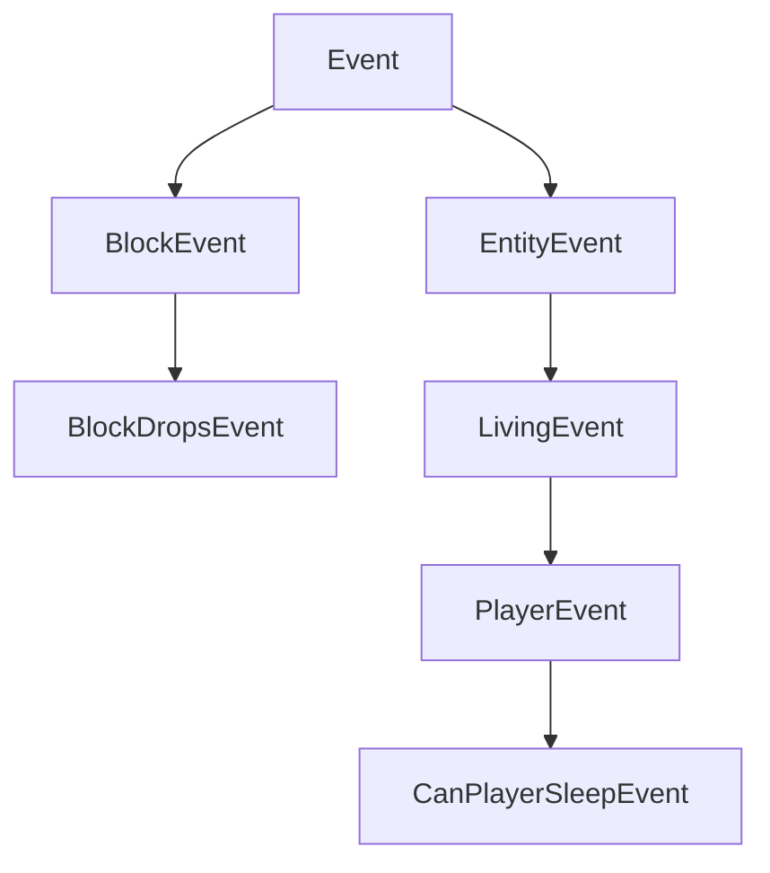

# NeoForge 入门与概念

> 来源:neoforged/Documentation 官方文档(英文原文,API 名与代码签名原样保留)。
> 回答时用中文解释,类名/方法名保持英文。

## concepts/events

---
sidebar_position: 3
---
import Tabs from '@theme/Tabs';
import TabItem from '@theme/TabItem';

# Events

One of NeoForge's main features is the event system. Events are fired for various things that happen in the game. For example, there are events for when the player right clicks, when a player or another entity jumps, when blocks are rendered, when the game is loaded, etc. A modder can subscribe event handlers to each of these events, and then perform their desired behavior inside these event handlers.

Events are fired on their respective event bus. The most important bus is `NeoForge.EVENT_BUS`, also known as the **game** bus. Besides that, during startup, a mod bus is spawned for each loaded mod and passed into the mod's constructor. Many mod bus events are fired in parallel (as opposed to main bus events that always run on the same thread), dramatically increasing startup speed. See [below][modbus] for more information.

## Registering an Event Handler

There are multiple ways to register event handlers. Common for all of those ways is that every event handler is a method with a single event parameter and no result (i.e. return type `void`).

### `IEventBus#addListener`

The simplest way to register method handlers is by registering their method reference, like so:

```java
@Mod("yourmodid")
public class YourMod {
    public YourMod(IEventBus modBus) {
        NeoForge.EVENT_BUS.addListener(YourMod::onLivingJump);
    }

    // Heals an entity by half a heart every time they jump.
    private static void onLivingJump(LivingEvent.LivingJumpEvent event) {
        LivingEntity entity = event.getEntity();
        // Only heal on the server side
        if (!entity.level().isClientSide()) {
            entity.heal(1);
        }
    }
}
```

### `@SubscribeEvent`

Alternatively, event handlers can be annotation-driven by creating an event handler method and annotating it with `@SubscribeEvent`. Then, you can pass an instance of the encompassing class to the event bus, registering all `@SubscribeEvent`-annotated event handlers of that instance:

```java
public class EventHandler {
    @SubscribeEvent
    public void onLivingJump(LivingEvent.LivingJumpEvent event) {
        LivingEntity entity = event.getEntity();
        if (!entity.level().isClientSide()) {
            entity.heal(1);
        }
    }
}

@Mod("yourmodid")
public class YourMod {
    public YourMod(IEventBus modBus) {
        NeoForge.EVENT_BUS.register(new EventHandler());
    }
}
```

You can also do it statically. Simply make all event handlers static, and instead of a class instance, pass in the class itself:

```java
public class EventHandler {
	@SubscribeEvent
    public static void onLivingJump(LivingEvent.LivingJumpEvent event) {
        LivingEntity entity = event.getEntity();
        if (!entity.level().isClientSide()) {
            entity.heal(1);
        }
    }
}

@Mod("yourmodid")
public class YourMod {
    public YourMod(IEventBus modBus) {
        NeoForge.EVENT_BUS.register(EventHandler.class);
    }
}
```

### `@EventBusSubscriber`

We can go one step further and also annotate the event handler class with `@EventBusSubscriber`. This annotation is discovered automatically by NeoForge, allowing you to remove all event-related code from the mod constructor. In essence, it is equivalent to calling `NeoForge.EVENT_BUS.register(EventHandler.class)` and `modBus.register(EventHandler.class)` at the end of the mod constructor. This means that all handlers must be static, too.

While not required, it is highly recommended to specify the `modid` parameter in the annotation, in order to make debugging easier (especially when it comes to mod conflicts).

```java
@EventBusSubscriber(modid = "yourmodid")
public class EventHandler {
    @SubscribeEvent
    public static void onLivingJump(LivingEvent.LivingJumpEvent event) {
        LivingEntity entity = event.getEntity();
        if (!entity.level().isClientSide()) {
            entity.heal(1);
        }
    }
}
```

## Event Options

### Fields and Methods

Fields and methods are probably the most obvious part of an event. Most events contain context for the event handler to use, such as an entity causing the event or a level the event occurs in.

### Hierarchy

In order to use the advantages of inheritance, some events do not directly extend `Event`, but one of its subclasses, for example `BlockEvent` (which contains block context for block-related events) or `EntityEvent` (which similarly contains entity context) and its subclasses `LivingEvent` (for `LivingEntity`-specific context) and `PlayerEvent` (for `Player`-specific context). These context-providing super events are `abstract` and cannot be listened to.

:::danger
If you listen to an `abstract` event, your game will crash, as this is never what you want. You always want to listen to one of the subevents instead.
:::



### Cancellable Events

Some events implement the `ICancellableEvent` interface. These events can be cancelled using `#setCanceled(boolean canceled)`, and the cancellation status can be checked using `#isCanceled()`. If an event is cancelled, other event handlers for this event will not run, and some kind of behavior that is associated with "cancelling" is enabled. For example, cancelling `LivingChangeTargetEvent` will prevent the entity's target entity from changing.

Event handlers can opt to explicitly receive cancelled events. This is done by setting the `receiveCanceled` boolean parameter in `IEventBus#addListener` (or `@SubscribeEvent`, depending on your way of attaching the event handlers) to true.

### TriStates and Results

Some events have three potential return states represented by `TriState`, or a `Result` enum directly on the event class. The return states can typically either cancel the action the event is handling (`TriState#FALSE`), force the action to run (`TriState#TRUE`), or execute default Vanilla behavior (`TriState#DEFAULT`).

An event with three potential return states has some `set*` method to set the desired outcome.

```java
// In some event handler class

@SubscribeEvent // on the game event bus
public static void renderNameTag(RenderNameTagEvent.CanRender event) {
    // Uses TriState to set the return state
    event.setCanRender(TriState.FALSE);
}

@SubscribeEvent // on the game event bus
public static void mobDespawn(MobDespawnEvent event) {
    // Uses a Result enum to set the return state
    event.setResult(MobDespawnEvent.Result.DENY);
}
```

### Priority

Event handlers can optionally get assigned a priority. The `EventPriority` enum contains five values: `HIGHEST`, `HIGH`, `NORMAL` (default), `LOW` and `LOWEST`. Event handlers are executed from highest to lowest priority. If they have the same priority, they fire in registration order on the main bus, which is roughly related to mod load order, and in exact mod load order on the mod bus (see below).

Priorities can be defined by setting the `priority` parameter in `IEventBus#addListener` or `@SubscribeEvent`, depending on how you attach event handlers. Note that priorities are ignored for events that are fired in parallel.

### Sided Events

Some events are only fired on one [side][side]. Common examples include the various render events, which are only fired on the client. Since client-only events generally need to access other client-only parts of the Minecraft codebase, they need to be registered accordingly.

Event handlers that use `IEventBus#addListener` should check the current physical side via `FMLEnvironment#getDist` or the `Dist` parameter in your main mod constructor and add the listener in a separate client-only class, as outlined in the article on [sides][side].

Event handlers that use `@EventBusSubscriber` can specify the side as the `value` parameter of the annotation, for example `@EventBusSubscriber(value = Dist.CLIENT, modid = "yourmodid")`.

## Event Buses

While most events are posted on the `NeoForge.EVENT_BUS`, some events are posted on the mod event bus instead. These are generally called mod bus events. Mod bus events can be distinguished from regular events by their superinterface `IModBusEvent`.

The mod event bus is passed to you as a parameter in the mod constructor, and you can then subscribe mod bus events to it. If you use `@EventBusSubscriber`, the event will automatically be subscribed to the correct bus.

### The Mod Lifecycle

Most mod bus events are what is known as lifecycle events. Lifecycle events run once in every mod's lifecycle during startup. Many of them are fired in parallel by subclassing `ParallelDispatchEvent`; if you want to run code from one of these events on the main thread, enqueue them using `#enqueueWork(Runnable runnable)`.

The lifecycle generally follows the following order:

- The mod constructor is called. Register your event handlers here, or in the next step.
- All `@EventBusSubscriber`s are called.
- `FMLConstructModEvent` is fired.
- The registry events are fired, these include [`NewRegistryEvent`][newregistry], [`DataPackRegistryEvent.NewRegistry`][newdatapackregistry] and, for each registry, [`RegisterEvent`][registerevent].
- `FMLCommonSetupEvent` is fired. This is where various miscellaneous setup happens.
- The [sided][side] setup is fired: `FMLClientSetupEvent` if on a physical client, and `FMLDedicatedServerSetupEvent` if on a physical server.
- `InterModComms` are handled (see below).
- `FMLLoadCompleteEvent` is fired.

#### `InterModComms`

`InterModComms` is a system that allows modders to send messages to other mods for compatibility features. The class holds the messages for mods, all methods are thread-safe to call. The system is mainly driven by two events: `InterModEnqueueEvent` and `InterModProcessEvent`.

During `InterModEnqueueEvent`, you can use `InterModComms#sendTo` to send messages to other mods. These methods accept the id of the mod to send the message to, the key associated with the message data (to distinguish between different messages), and a `Supplier` holding the message data. The sender can be optionally specified as well.

Then, during `InterModProcessEvent`, you can use `InterModComms#getMessages` to get a stream of all received messages as `IMCMessage` objects. These hold the sender of the data, the intended receiver of the data, the data key, and the supplier for the actual data.

### Other Mod Bus Events

Next to the lifecycle events, there are a few miscellaneous events that are fired on the mod event bus, mostly for legacy reasons. These are generally events where you can register, set up, or initialize various things. Most of these events are not ran in parallel in contrast to the lifecycle events. A few examples:

- `RegisterColorHandlersEvent.BlockTintSources`, `.ItemTintSources`, `.ColorResolvers` 
- `ModelEvent.BakingCompleted`
- `TextureAtlasStitchedEvent`

:::warning
Most of these events are planned to be moved to the game event bus in a future version.
:::

[modbus]: #event-buses
[newdatapackregistry]: registries.md#custom-datapack-registries
[newregistry]: registries.md#custom-registries
[registerevent]: registries.md#registerevent
[side]: sides.md

## concepts/registries

---
sidebar_position: 1
---
# Registries

Registration is the process of taking the objects of a mod (such as [items][item], [blocks][block], entities, etc.) and making them known to the game. Registering things is important, as without registration the game will simply not know about these objects, which will cause unexplainable behaviors and crashes.

A registry is, simply put, a wrapper around a map that maps registry names (read on) to registered objects, often called registry entries. Registry names must be unique within the same registry, but the same registry name may be present in multiple registries. The most common example for this are blocks (in the `BLOCKS` registry) that have an item form with the same registry name (in the `ITEMS` registry).

Every registered object has a unique name, called its registry name. The name is represented as an [`Identifier`][identifier]. For example, the registry name of the dirt block is `minecraft:dirt`, and the registry name of the zombie is `minecraft:zombie`. Modded objects will of course not use the `minecraft` namespace; their mod id will be used instead.

## Vanilla vs. Modded

To understand some of the design decisions that were made in NeoForge's registry system, we will first look at how Minecraft does this. We will use the block registry as an example, as most other registries work the same way.

Registries generally register [singletons][singleton]. This means that all registry entries exist exactly once. For example, all stone blocks you see throughout the game are actually the same stone block, displayed many times. If you need the stone block, you can get it by referencing the registered block instance.

Minecraft registers all blocks in the `Blocks` class. Through the `register` method, `Registry#register()` is called, with the block registry at `BuiltInRegistries.BLOCK` being the first parameter. After all blocks are registered, Minecraft performs various checks based on the list of blocks, for example the self check that verifies that all blocks have a model loaded.

The main reason all of this works is that `Blocks` is classloaded early enough by Minecraft. Mods are not automatically classloaded by Minecraft, and thus workarounds are needed.

## Methods for Registering

NeoForge offers two ways to register objects: the `DeferredRegister` class, and the `RegisterEvent`. Note that the former is a wrapper around the latter, and is recommended in order to prevent mistakes.

### `DeferredRegister`

We begin by creating our `DeferredRegister`:

```java
public static final DeferredRegister<Block> BLOCKS = DeferredRegister.create(
        // The registry we want to use.
        // Minecraft's registries can be found in BuiltInRegistries, NeoForge's registries can be found in NeoForgeRegistries.
        // Mods may also add their own registries, refer to the individual mod's documentation or source code for where to find them.
        BuiltInRegistries.BLOCK,
        // Our mod id.
        ExampleMod.MOD_ID
);
```

We can then add our registry entries as static final fields using one of the following methods (see [the article on Blocks][block] for what parameters to add in `new Block()`):

```java
public static final DeferredHolder<Block, Block> EXAMPLE_BLOCK_1 = BLOCKS.register(
        // Our registry name.
        "example_block",
        // A supplier of the object we want to register.
        () -> new Block(...)
);

public static final DeferredHolder<Block, SlabBlock> EXAMPLE_BLOCK_2 = BLOCKS.register(
        // Our registry name.
        "example_block",
        // A function creating the object we want to register
        // given its registry name as a Identifier.
        registryName -> new SlabBlock(...)
);
```

The class `DeferredHolder<R, T extends R>` holds our object. The type parameter `R` is the type of the registry we are registering to (in our case `Block`). The type parameter `T` is the type of our supplier. Since we directly register a `Block` in the first example, we provide `Block` as the second parameter. If we were to register an object of a subclass of `Block`, for example `SlabBlock` (as shown in the second example), we would provide `SlabBlock` here instead.

`DeferredHolder<R, T extends R>` is a subclass of `Supplier<T>`. To get our registered object when we need it, we can call `DeferredHolder#get()`. The fact that `DeferredHolder` extends `Supplier` also allows us to use `Supplier` as the type of our field. That way, the above code block becomes the following:

```java
public static final Supplier<Block> EXAMPLE_BLOCK_1 = BLOCKS.register(
        // Our registry name.
        "example_block",
        // A supplier of the object we want to register.
        () -> new Block(...)
);

public static final Supplier<SlabBlock> EXAMPLE_BLOCK_2 = BLOCKS.register(
        // Our registry name.
        "example_block",
        // A function creating the object we want to register
        // given its registry name as a Identifier.
        registryName -> new SlabBlock(...)
);
```

:::note
Be aware that a few places explicitly require a `Holder` or `DeferredHolder` and will not just accept any `Supplier`. If you need either of those two, it is best to change the type of your `Supplier` back to `Holder` or `DeferredHolder` as necessary.
:::

Finally, since the entire system is a wrapper around registry events, we need to tell the `DeferredRegister` to attach itself to the registry events as needed:

```java
//This is our mod constructor
public ExampleMod(IEventBus modBus) {
    //highlight-next-line
    ExampleBlocksClass.BLOCKS.register(modBus);
    //Other stuff here
}
```

:::info
There are specialized variants of `DeferredRegister`s for blocks, items, and data components that provide helper methods: [`DeferredRegister.Blocks`][defregblocks], [`DeferredRegister.Items`][defregitems], [`DeferredRegister.DataComponents`][defregcomp], and [`DeferredRegister.Entities`][defregentity] respectively.
:::

### `RegisterEvent`

`RegisterEvent` is the second way to register objects. This [event][event] is fired for each registry, after the mod constructors (since those are where `DeferredRegister`s register their internal event handlers) and before the loading of configs. `RegisterEvent` is fired on the mod event bus.

```java
@SubscribeEvent // on the mod event bus
public static void register(RegisterEvent event) {
    event.register(
            // This is the registry key of the registry.
            // Get these from BuiltInRegistries for vanilla registries,
            // or from NeoForgeRegistries.Keys for NeoForge registries.
            BuiltInRegistries.BLOCK,
            // Register your objects here.
            registry -> {
                registry.register(Identifier.fromNamespaceAndPath(MODID, "example_block_1"), new Block(...));
                registry.register(Identifier.fromNamespaceAndPath(MODID, "example_block_2"), new Block(...));
                registry.register(Identifier.fromNamespaceAndPath(MODID, "example_block_3"), new Block(...));
            }
    );
}
```

## Querying Registries

Sometimes, you will find yourself in situations where you want to get a registered object by a given id. Or, you want to get the id of a certain registered object. Since registries are basically maps of ids (`Identifier`s) to distinct objects, i.e. a reversible map, both of these operations work:

```java
BuiltInRegistries.BLOCK.getValue(Identifier.fromNamespaceAndPath("minecraft", "dirt")); // returns the dirt block
BuiltInRegistries.BLOCK.getKey(Blocks.DIRT); // returns the resource location "minecraft:dirt"

// Assume that ExampleBlocksClass.EXAMPLE_BLOCK.get() is a Supplier<Block> with the id "yourmodid:example_block"
BuiltInRegistries.BLOCK.getValue(Identifier.fromNamespaceAndPath("yourmodid", "example_block")); // returns the example block
BuiltInRegistries.BLOCK.getKey(ExampleBlocksClass.EXAMPLE_BLOCK.get()); // returns the resource location "yourmodid:example_block"
```

If you just want to check for the presence of an object, this is also possible, though only with keys:

```java
BuiltInRegistries.BLOCK.containsKey(Identifier.fromNamespaceAndPath("minecraft", "dirt")); // true
BuiltInRegistries.BLOCK.containsKey(Identifier.fromNamespaceAndPath("create", "brass_ingot")); // true only if Create is installed
```

As the last example shows, this is possible with any mod id, and thus a perfect way to check if a certain item from another mod exists.

Finally, we can also iterate over all entries in a registry, either over the keys or over the entries (entries use the Java `Map.Entry` type):

```java
for (Identifier id : BuiltInRegistries.BLOCK.keySet()) {
    // ...
}
for (Map.Entry<ResourceKey<Block>, Block> entry : BuiltInRegistries.BLOCK.entrySet()) {
    // ...
}
```

:::note
Query operations always use vanilla `Registry`s, not `DeferredRegister`s. This is because `DeferredRegister`s are merely registration utilities.
:::

:::danger
Query operations are only safe to use after registration has finished. **DO NOT QUERY REGISTRIES WHILE REGISTRATION IS STILL ONGOING!**
:::

## Custom Registries

Custom registries allow you to specify additional systems that addon mods for your mod may want to plug into. For example, if your mod were to add spells, you could make the spells a registry and thus allow other mods to add spells to your mod, without you having to do anything else. It also allows you to do some things, such as syncing the entries, automatically.

Let's start by creating the [registry key][resourcekey] and the registry itself:

```java
// We use spells as an example for the registry here, without any details about what a spell actually is (as it doesn't matter).
// Of course, all mentions of spells can and should be replaced with whatever your registry actually is.
public static final ResourceKey<Registry<Spell>> SPELL_REGISTRY_KEY = ResourceKey.createRegistryKey(Identifier.fromNamespaceAndPath("yourmodid", "spells"));
public static final Registry<YourRegistryContents> SPELL_REGISTRY = new RegistryBuilder<>(SPELL_REGISTRY_KEY)
        // If you want to enable integer id syncing, for networking.
        // These should only be used in networking contexts, for example in packets or purely networking-related NBT data.
        .sync(true)
        // The default key. Similar to minecraft:air for blocks. This is optional.
        .defaultKey(Identifier.fromNamespaceAndPath("yourmodid", "empty"))
        // Effectively limits the max count. Generally discouraged, but may make sense in settings such as networking.
        .maxId(256)
        // Build the registry.
        .create();
```

Then, tell the game that the registry exists by registering them to the root registry in `NewRegistryEvent`:

```java
@SubscribeEvent // on the mod event bus
public static void registerRegistries(NewRegistryEvent event) {
    event.register(SPELL_REGISTRY);
}
```

You can now register new registry contents like with any other registry, through both `DeferredRegister` and `RegisterEvent`:

```java
public static final DeferredRegister<Spell> SPELLS = DeferredRegister.create(SPELL_REGISTRY, "yourmodid");
public static final Supplier<Spell> EXAMPLE_SPELL = SPELLS.register("example_spell", () -> new Spell(...));

// Alternatively:
@SubscribeEvent // on the mod event bus
public static void register(RegisterEvent event) {
    event.register(SPELL_REGISTRY_KEY, registry -> {
        registry.register(Identifier.fromNamespaceAndPath("yourmodid", "example_spell"), () -> new Spell(...));
    });
}
```

## Datapack Registries

A datapack registry (also known as a dynamic registry or, after its main use case, worldgen registry) is a special kind of registry that loads data from [datapack][datapack] JSONs (hence the name) at world load, instead of loading them when the game starts. Default datapack registries most notably include most worldgen registries, among a few others.

Datapack registries allow their contents to be specified in JSON files. This means that no code (other than [datagen][datagen] if you don't want to write the JSON files yourself) is necessary. Every datapack registry has a [`Codec`][codec] associated with it, which is used for serialization, and each registry's id determines its datapack path:

- Minecraft's datapack registries use the format `data/yourmodid/registrypath` (for example `data/yourmodid/worldgen/biome`, where `worldgen/biome` is the registry path).
- All other datapack registries (NeoForge or modded) use the format `data/yourmodid/registrynamespace/registrypath` (for example `data/yourmodid/neoforge/biome_modifier`, where `neoforge` is the registry namespace and `biome_modifier` is the registry path).

Datapack registries can be obtained from a `RegistryAccess`. This `RegistryAccess` can be retrieved by calling `ServerLevel#registryAccess()` if on the server, or `Minecraft.getInstance().getConnection()#registryAccess()` if on the client (the latter only works if you are actually connected to a world, as otherwise the connection will be null). The result of these calls can then be used like any other registry to get specific elements, or to iterate over the contents.

### Custom Datapack Registries

Custom datapack registries do not require a `Registry` to be constructed. Instead, they just need a registry key and at least one [`Codec`][codec] to (de-)serialize its contents. Reiterating on the spells example from before, registering our spell registry as a datapack registry looks something like this:

```java
public static final ResourceKey<Registry<Spell>> SPELL_REGISTRY_KEY = ResourceKey.createRegistryKey(Identifier.fromNamespaceAndPath("yourmodid", "spells"));

@SubscribeEvent // on the mod event bus
public static void registerDatapackRegistries(DataPackRegistryEvent.NewRegistry event) {
    event.dataPackRegistry(
            // The registry key.
            SPELL_REGISTRY_KEY,
            // The codec of the registry contents.
            Spell.CODEC,
            // The network codec of the registry contents. Often identical to the normal codec.
            // May be a reduced variant of the normal codec that omits data that is not needed on the client.
            // May be null. If null, registry entries will not be synced to the client at all.
            // May be omitted, which is functionally identical to passing null (a method overload
            // with two parameters is called that passes null to the normal three parameter method).
            Spell.CODEC,
            // A consumer which configures the constructed registry via the RegistryBuilder.
            // May be omitted, which is functionally identical to passing builder -> {}.
            builder -> builder.maxId(256)
    );
}
```

### Data Generation for Datapack Registries

Since writing all the JSON files by hand is both tedious and error-prone, NeoForge provides a [data provider][datagenindex] to generate the JSON files for you. This works for both built-in and your own datapack registries.

First, we create a `RegistrySetBuilder` and add our entries to it (one `RegistrySetBuilder` can hold entries for multiple registries):

```java
new RegistrySetBuilder()
    .add(Registries.CONFIGURED_FEATURE, bootstrap -> {
        // Register configured features through the bootstrap context (see below)
    })
    .add(Registries.PLACED_FEATURE, bootstrap -> {
        // Register placed features through the bootstrap context (see below)
    });
```

The `bootstrap` lambda parameter is what we actually use to register our objects. It has the type `BootstrapContext`. To register an object, we call `#register` on it, like so:

```java
// The resource key of our object.
public static final ResourceKey<ConfiguredFeature<?, ?>> EXAMPLE_CONFIGURED_FEATURE = ResourceKey.create(
    Registries.CONFIGURED_FEATURE,
    Identifier.fromNamespaceAndPath(MOD_ID, "example_configured_feature")
);

new RegistrySetBuilder()
    .add(Registries.CONFIGURED_FEATURE, bootstrap -> {
        bootstrap.register(
            // The resource key of our configured feature.
            EXAMPLE_CONFIGURED_FEATURE,
            // The actual configured feature.
            new ConfiguredFeature<>(Feature.ORE, new OreConfiguration(...))
        );
    })
    .add(Registries.PLACED_FEATURE, bootstrap -> {
        // ...
    });
```

The `BootstrapContext` can also be used to lookup entries from another registry if needed:

```java
public static final ResourceKey<ConfiguredFeature<?, ?>> EXAMPLE_CONFIGURED_FEATURE = ResourceKey.create(
    Registries.CONFIGURED_FEATURE,
    Identifier.fromNamespaceAndPath(MOD_ID, "example_configured_feature")
);
public static final ResourceKey<PlacedFeature> EXAMPLE_PLACED_FEATURE = ResourceKey.create(
    Registries.PLACED_FEATURE,
    Identifier.fromNamespaceAndPath(MOD_ID, "example_placed_feature")
);

new RegistrySetBuilder()
    .add(Registries.CONFIGURED_FEATURE, bootstrap -> {
        bootstrap.register(EXAMPLE_CONFIGURED_FEATURE, ...);
    })
    .add(Registries.PLACED_FEATURE, bootstrap -> {
        HolderGetter<ConfiguredFeature<?, ?>> otherRegistry = bootstrap.lookup(Registries.CONFIGURED_FEATURE);
        bootstrap.register(EXAMPLE_PLACED_FEATURE, new PlacedFeature(
            otherRegistry.getOrThrow(EXAMPLE_CONFIGURED_FEATURE), // Get the configured feature
            List.of() // No-op when placement happens - replace with whatever your placement parameters are
        ));
    });
```

Finally, we use our `RegistrySetBuilder` in an actual data provider, and register that data provider to the event:

```java
@SubscribeEvent // on the mod event bus
public static void onGatherData(GatherDataEvent.Client event) {
    // Adds the generated registry objects to the current lookup provider for use
    // in other datagen.
    event.createDatapackRegistryObjects(
        // Our registry set builder to generate the data from.
        new RegistrySetBuilder().add(...),
        // (Optional) A biconsumer that takes in any conditions to load the object
        // associated with the resource key
        conditions -> {
            conditions.accept(resourceKey, condition);
        },
        // (Optional) A set of mod ids we are generating the entries for
        // By default, supplies the mod id of the current mod container.
        Set.of("yourmodid")
    );

    // You can use the lookup provider with your generated entries by either calling one
    // of the `#create*` methods or grabbing the actual lookup via `#getLookupProvider`
    // ...
}
```

[block]: ../blocks/index.md
[blockentity]: ../blockentities/index.md
[codec]: ../datastorage/codecs.md
[datagen]: #data-generation-for-datapack-registries
[datagenindex]: ../resources/index.md#data-generation
[datapack]: ../resources/index.md#data
[defregblocks]: ../blocks/index.md#deferredregisterblocks-helpers
[defregcomp]: ../items/datacomponents.md#creating-custom-data-components
[defregentity]: ../entities/index.md#entitytype
[defregitems]: ../items/index.md#deferredregisteritems
[event]: events.md
[item]: ../items/index.md
[identifier]: ../misc/identifier.md
[resourcekey]: ../misc/identifier.md#resourcekeys
[singleton]: https://en.wikipedia.org/wiki/Singleton_pattern

## concepts/sides

---
sidebar_position: 2
---
# Sides

Like many other programs, Minecraft follows a client-server concept, where the client is responsible for displaying the data, while the server is responsible for updating them. When using these terms, we have a fairly intuitive understanding of what we mean... right?

Turns out, not so much. A lot of the confusion stems from Minecraft having two different concepts of sides, depending on the context: the physical and the logical side.

## Logical vs. Physical Side

### The Physical Side

When you open your Minecraft launcher, select a Minecraft installation and press play, you boot up a **physical client**. The word "physical" is used here in the sense of "this is a client program". This especially means that client-side functionality, such as all the rendering stuff, is available here and can be used as needed. In contrast, the **physical server**, also known as dedicated server, is what opens when you launch a Minecraft server JAR. While the Minecraft server comes with a rudimentary GUI, it is missing all client-only functionality. Most notably, this means that various client classes are missing from the server JAR. Calling these classes on the physical server will lead to missing class errors, i.e. crashes, so we need to safeguard against this.

### The Logical Side

The logical side is mainly focused on the internal program structure of Minecraft. The **logical server** is where the game logic runs. Things like time and weather changing, entity ticking, entity spawning, etc. all run on the server. All kinds of data, such as inventory contents, are the server's responsibility as well. The **logical client**, on the other hand, is responsible for displaying everything there is to display. Minecraft keeps all the client code in an isolated `net.minecraft.client` package, and runs it in a separate thread called the Render Thread, while everything else is considered common (i.e. client and server) code.

### What's the Difference?

The difference between physical and logical sides is best exemplified by two scenarios:

- The player joins a **multiplayer** world. This is fairly straightforward: The player's physical (and logical) client connects to a physical (and logical) server somewhere else - the player does not care where; so long as they can connect, that's all the client knows of, and all the client needs to know.
- The player joins a **singleplayer** world. This is where things get interesting. The player's physical client spins up a logical server and then, now in the role of the logical client, connects to that logical server on the same machine. If you are familiar with networking, you can think of it as a connection to `localhost` (only conceptually; there are no actual sockets or similar involved).

These two scenarios also show the main problem with this: If a logical server can work with your code, that alone doesn't guarantee that a physical server will be able to work with as well. This is why you should always test with dedicated servers to check for unexpected behavior. `NoClassDefFoundError`s and `ClassNotFoundException`s due to incorrect client and server separation are among the most common errors there are in modding. Another common mistake is working with static fields and accessing them from both logical sides; this is particularly tricky because there's usually no indication that something is wrong.

:::tip
If you need to transfer data from one side to another, you must [send a packet][networking].
:::

In the NeoForge codebase, the physical side is represented by an enum called `Dist`, while the logical side is represented by an enum called `LogicalSide`.

:::info
Historically, server JARs have had classes the client did not. This is not the case anymore in modern versions; physical servers are a subset of physical clients, if you will.
:::

## Performing Side-Specific Operations

### `Level#isClientSide()`

This boolean check will be your most used way to check sides. Querying this field on a `Level` object establishes the  **logical** side the level belongs to: If this field is `true`, the level is running on the logical client. If the field is `false`, the level is running on the logical server. It follows that the physical server will always contain `false` in this field, but we cannot assume that `false` implies a physical server, since this field can also be `false` for the logical server inside a physical client (i.e. a singleplayer world).

Use this check whenever you need to determine if game logic and other mechanics should be run. For example, if you want to damage the player every time they click your block, or have your machine process dirt into diamonds, you should only do so after ensuring `#isClientSide()` is `false`. Applying game logic to the logical client can cause desynchronization (ghost entities, desynchronized stats, etc.) in the best case, and crashes in the worst case.

:::tip
This check should be used as your go-to default. Whenever you have a `Level` available, use this check.
:::

### `FMLEnvironment#getDist()`

`FMLEnvironment#getDist()` is the **physical** counterpart to a `Level#isClientSide()` check. If this field is `Dist.CLIENT`, you are on a physical client. If the field is `Dist.DEDICATED_SERVER`, you are on a physical server.

#### `@Mod`

Checking the physical environment is important when dealing with client-only classes. The recommended way to separate code that should only be executed on one physical client is by specifying a separate [`@Mod` annotation][mod], setting the `dist` parameter to the physical side the mod class should be loaded on:

```java
@Mod("examplemod")
public class ExampleMod {
    public ExampleMod(IEventBus modBus) {
        // Perform logic in that should be executed on both sides
    }
}

@Mod(value = "examplemod", dist = Dist.CLIENT) 
public class ExampleModClient {
    public ExampleModClient(IEventBus modBus) {
        // Perform logic in that should only be executed on the physical client
    }
}

@Mod(value = "examplemod", dist = Dist.DEDICATED_SERVER) 
public class ExampleModDedicatedServer {
    public ExampleModDedicatedServer(IEventBus modBus) {
        // Perform logic in that should only be executed on the physical server
    }
}
```

:::tip
Mods are generally expected to work on either side. This especially means that if you are developing a client-only mod, you should verify that the mod actually runs on a physical client, and no-op in the event that it does not.
:::

[networking]: ../networking/index.md
[mod]: ../gettingstarted/modfiles.md#javafml-and-mod

## gettingstarted/index

# Getting Started with NeoForge

This section includes information about how to set up a NeoForge workspace, and how to run and test your mod.

## Prerequisites

- Familiarity with the Java programming language, specifically its object-oriented, polymorphic, generic, and functional features.
- An installation of the Java 25 Development Kit (JDK) and 64-bit Java Virtual Machine (JVM). NeoForge recommends and officially supports the [Microsoft builds of OpenJDK][jdk], but any other JDK should work as well.

:::caution
Make sure you are using a 64-bit JVM. One way of checking is to run `java -version` in a terminal. Minecraft does not support 32-bit JVMs.
:::

- Familiarity with an Integrated Development Environment (IDE) of your choice.
    - NeoForge officially supports [IntelliJ IDEA][intellij] and [Eclipse][eclipse], both of which have integrated Gradle support. However, any IDE can be used, ranging from Netbeans or Visual Studio Code to Vim or Emacs.
- Familiarity with [Git][git] and [GitHub][github]. This is technically not required, but it will make your life a lot easier.

## Setting Up the Workspace

- Go to the [Mod Generator][modgen] webpage, type in a mod name (and optionally a mod id), package name, Minecraft version, and Gradle plugin (either [ModDevGradle][mdg] or [NeoGradle][ng]), click "Download Mod Project", and extract the downloaded ZIP file.
- Open your IDE and import the Gradle project. Eclipse and IntelliJ IDEA will do this automatically for you. If you have an IDE that does not do this, you can also do it via the `gradlew` terminal command.
    - When doing this for the first time, Gradle will download all dependencies of NeoForge, including Minecraft itself, and decompile them. This can take a fair amount of time (up to an hour, depending on your hardware and network strength).
    - Whenever you make a change to the Gradle files, the Gradle changes will need to be reloaded, either through the "Reload Gradle" button in your IDE, or again through the `gradlew` terminal command.

## Customizing Your Mod Information

Many of the basic properties of your mod can be changed in the `gradle.properties` file. This includes basic things like the mod name or the mod version. For more information, see the comments in the `gradle.properties` file, or see [the documentation of the `gradle.properties` file][properties].

If you want to modify the build process beyond that, you can edit the `build.gradle` and `settings.gradle` file. The Gradle plugins provided by NeoForge, either [ModDevGradle][mdg] or [NeoGradle][ng], provide several configuration options, a few of which are explained within the buildscript as comments.

:::caution
Only edit the `build.gradle` and `settings.gradle` files if you know what you are doing. All basic properties can be set via `gradle.properties`.
:::

## Building and Testing Your Mod

To build your mod, run `gradlew build`. This will output a file in `build/libs` with the name `<archivesBaseName>-<version>.jar`. `<archivesBaseName>` and `<version>` are properties set by the `build.gradle` and default to the `mod_id` and `mod_version` values in the `gradle.properties` file, respectively; this can be changed in the `build.gradle` if desired. The resulting JAR file can then be placed in the `mods` folder of a NeoForge-enabled Minecraft setup, or uploaded to a mod distribution platform.

To run your mod in a test environment, you can either use the generated run configurations or use the associated tasks (e.g. `gradlew runClient`). This will launch Minecraft from the corresponding runs directory (e.g. `runs/client` or `runs/server`), along with any source sets specified. The default MDK includes the `main` source set, so any code written in `src/main/java` will be applied.

### Server Testing

If you are running a dedicated server, whether through the run configuration or `gradlew runServer`, the server will shut down immediately. You will need to accept the Minecraft EULA by editing the `eula.txt` file in the run directory.

Once accepted, the server will load and become available under `localhost` (or `127.0.0.1` by default). However, you will still not able to join, because the server will be put into online mode by default, which requires authentication (that the Dev player does not have). To fix this, stop your server again and set the `online-mode` property in the `server.properties` file to `false`. Now, start your server, and you should be able to connect.

:::tip
You should always test your mod in a dedicated server environment. This includes [client-only mods][client], as these should not do anything when loaded on the server.
:::

[client]: ../concepts/sides.md
[eclipse]: https://www.eclipse.org/downloads/
[git]: https://www.git-scm.com/
[github]: https://github.com/
[intellij]: https://www.jetbrains.com/idea/
[jdk]: https://learn.microsoft.com/en-us/java/openjdk/download#openjdk-25
[mdg]: https://github.com/neoforged/ModDevGradle
[modgen]: https://neoforged.net/mod-generator/
[ng]: https://github.com/neoforged/NeoGradle
[properties]: modfiles.md#gradleproperties

## gettingstarted/modfiles

# Mod Files

The mod files are responsible for determining what mods are packaged into your JAR, what information to display within the 'Mods' menu, and how your mod should be loaded in the game.

## `gradle.properties`

The `gradle.properties` file holds various common properties of your mod, such as the mod id or mod version. During building, Gradle reads the values in these files and inlines them in various places, such as the [neoforge.mods.toml][neoforgemodstoml] file. This way, you only need to change values in one place, and they are then applied everywhere for you.

Most values are also explained as comments in [the MDK's `gradle.properties` file][mdkgradleproperties].

| Property                  | Description                                                                                                                                                                                                                             | Example                                    |
|---------------------------|-----------------------------------------------------------------------------------------------------------------------------------------------------------------------------------------------------------------------------------------|--------------------------------------------|
| `org.gradle.jvmargs`      | Allows you to pass extra JVM arguments to Gradle. Most commonly, this is used to assign more/less memory to Gradle. Note that this is for Gradle itself, not Minecraft.                                                                 | `org.gradle.jvmargs=-Xmx3G`                |
| `org.gradle.daemon`       | Whether Gradle should use the daemon when building.                                                                                                                                                                                     | `org.gradle.daemon=false`                  |
| `org.gradle.parallel`     | Whether Gradle should fork JVMs to execute projects in parallel.                                                                                                                                                                                     | `org.gradle.parallel=false`                  |
| `org.gradle.caching`      | Whether Gradle should reuse task outputs from previous builds.                                                                                                                                                                                     | `org.gradle.caching=false`                  |
| `org.gradle.configuration-cache`  | Whether Gradle should reuse the build configuration from previous builds.                                                                                                                                                                                     | `org.gradle.configuration-cache=false`                  |
| `org.gradle.debug`        | Whether Gradle is set to debug mode. Debug mode mainly means more Gradle log output. Note that this is for Gradle itself, not Minecraft.                                                                                                | `org.gradle.debug=false`                   |
| `minecraft_version`       | The Minecraft version you are modding on. Must match with `neo_version`.                                                                                                                                                                | `minecraft_version=1.20.6`                 |
| `minecraft_version_range` | The Minecraft version range this mod can use, as a [Maven Version Range][mvr]. Note that [snapshots, pre-releases and release candidates][mcversioning] are not guaranteed to sort properly, as they do not follow maven versioning.    | `minecraft_version_range=[1.20.6,1.21)`    |
| `neo_version`             | The NeoForge version you are modding on. Must match with `minecraft_version`. See [NeoForge Versioning][neoversioning] for more information on how NeoForge versioning works.                                                           | `neo_version=20.6.62`                      |
| `mod_id`                  | See [The Mod ID][modid].                                                                                                                                                                                                                | `mod_id=examplemod`                        |
| `mod_name`                | The human-readable display name of your mod. By default, this can only be seen in the mod list, however, mods such as [JEI][jei] prominently display mod names in item tooltips as well.                                                | `mod_name=Example Mod`                     |
| `mod_license`             | The license your mod is provided under. It is suggested that this is set to the [SPDX identifier][spdx] you are using and/or a link to the license. You can visit https://choosealicense.com/ to help pick the license you want to use. | `mod_license=MIT`                          |
| `mod_version`             | The version of your mod, shown in the mod list. See [the page on Versioning][versioning] for more information.                                                                                                                          | `mod_version=1.0`                          |
| `mod_group_id`            | See [The Group ID][group].                                                                                                                                                                                                              | `mod_group_id=com.example.examplemod`      |

### The Mod ID

The mod ID is the main way your mod is distinguished from others. It is used in a wide variety of places, including as the namespace for your mod's [registries][registration], and as your [resource and data pack][resource] namespaces. Having two mods with the same id will prevent the game from loading.

As such, your mod ID should be something unique and memorable. Usually, it will be your mod's display name (but lower case), or some variation thereof. Mod IDs may only contain lowercase letters, digits and underscores, and must be between 2 and 64 characters long (both inclusive).

:::info
Changing this property in the `gradle.properties` file will automatically apply the change everywhere, except for the [`@Mod` annotation][javafml] in your main mod class. There, you need to change it manually to match the value in the `gradle.properties` file.
:::

### The Group ID

While the `group` property in the `build.gradle` is only necessary if you plan to publish your mod to a maven, it is considered good practice to always properly set this. This is done for you through the `gradle.properties`'s `mod_group_id` property.

The group id should be set to your top-level package. See [Packaging][packaging] for more information.

```properties
# In your gradle.properties file
mod_group_id=com.example
```

The packages within your java source (`src/main/java`) should also now conform to this structure, with an inner package representing the mod id:

```text
com
- example (top-level package specified in group property)
    - mymod (the mod id)
        - MyMod.java (renamed ExampleMod.java)
```

## `neoforge.mods.toml`

The `neoforge.mods.toml` file, located at `src/main/resources/META-INF/neoforge.mods.toml`, is a file in [TOML][toml] format that defines the metadata of your mod(s). It also contains additional information on how your mod(s) should be loaded into the game, as well as display information that is displayed within the 'Mods' menu. The [`neoforge.mods.toml` file provided by the MDK][mdkneoforgemodstoml] contains comments explaining every entry, they will be explained here in more detail.

The `neoforge.mods.toml` can be separated into three parts: the non-mod-specific properties, which are linked to the mod file; the mod properties, with a section for each mod; and the dependency configurations, with a section for each mod's or mods' dependencies. Some of the properties associated with the `neoforge.mods.toml` file are mandatory; mandatory properties require a value to be specified, otherwise an exception will be thrown.

:::note
In the default MDK, Gradle replaces various properties in this file with the values specified in the `gradle.properties` file. For example, the line `license="${mod_license}"` means that the `license` field is replaced by the `mod_license` property from `gradle.properties`. Values that are replaced like this should be changed in the `gradle.properties` instead of changing them here.
:::

### Non-Mod-Specific Properties

Non-mod-specific properties are properties associated with the JAR itself, indicating how to load the mod(s) and any additional global metadata.

| Property             | Type     | Default        | Description                                                                                                                                                                                                                                                                                                                                         | Example                                                                        |
|----------------------|----------|----------------|-----------------------------------------------------------------------------------------------------------------------------------------------------------------------------------------------------------------------------------------------------------------------------------------------------------------------------------------------------|--------------------------------------------------------------------------------|
| `modLoader`          | string   | `javafml`      | The language loader used by the mod(s). Can be used to support alternative language structures, such as Kotlin objects for the main file, or different methods of determining the entrypoint, such as an interface or method. NeoForge provides the Java loader [`"javafml"`][javafml].  | `modLoader="javafml"`                                                          |
| `loaderVersion`      | string   | `""`           | The acceptable version range of the language loader, expressed as a [Maven Version Range][mvr]. For `javafml`, this is currently version `1`. If no version is specified, then any version of the mod loader can be used.                                                                                                                                                                                      | `loaderVersion="[1,)"`                                                         |
| `license`            | string   | **mandatory**  | The license the mod(s) in this JAR are provided under. It is suggested that this is set to the [SPDX identifier][spdx] you are using and/or a link to the license. You can visit https://choosealicense.com/ to help pick the license you want to use.                                                                                              | `license="MIT"`                                                                |
| `showAsResourcePack` | boolean  | `false`        | When `true`, the mod(s)'s resources will be displayed as a separate resource pack on the 'Resource Packs' menu, rather than being combined with the 'Mod Resources' pack.                                                                                                                                                                           | `showAsResourcePack=true`                                                      |
| `showAsDataPack`     | boolean  | `false`        | When `true`, the mod(s)'s data files will be displayed as a separate data pack on the 'Data Packs' menu, rather than being combined with the 'Mod Data' pack.                                                                                                                                                                           | `showAsDataPack=true`                                                          |
| `services`           | array    | `[]`           | An array of services your mod uses. This is consumed as part of the created module for the mod from NeoForge's implementation of the Java Platform Module System.                                                                                                                                                                                   | `services=["net.neoforged.neoforgespi.language.IModLanguageProvider"]`         |
| `properties`         | table    | `{}`           | A table of substitution properties. This is used by `StringSubstitutor` to replace `${file.<key>}` with its corresponding value.                                                                                                                                                                                                                    | `properties={"example"="1.2.3"}` (can then be referenced by `${file.example}`) |
| `issueTrackerURL`    | string   | _nothing_      | A URL representing the place to report and track issues with the mod(s).                                                                                                                                                                                                                                                                            | `"https://github.com/neoforged/NeoForge/issues"`                               |

:::note
The `services` property is functionally equivalent to specifying the [`uses` directive in a module][uses], which allows [loading a service of a given type][serviceload].

Alternatively, it can be defined in a service file inside the `src/main/resources/META-INF/services` folder, where the file name is the fully-qualified name of the service, and the file content is the name of the service to load (see also [this example from the AtlasViewer mod][atlasviewer]).
:::

### Mod-Specific Properties

Mod-specific properties are tied to the specified mod using the `[[mods]]` header. This is an [array of tables][array]; all key/value properties will be attached to that mod until the next header.

```toml
# Properties for examplemod1
[[mods]]
modId = "examplemod1"

# Properties for examplemod2
[[mods]]
modId = "examplemod2"
```

| Property         | Type     | Default                      | Description                                                                                                                                                                                                                                                                    | Example                                                         |
|------------------|----------|------------------------------|--------------------------------------------------------------------------------------------------------------------------------------------------------------------------------------------------------------------------------------------------------------------------------|-----------------------------------------------------------------|
| `modId`          | string   | **mandatory**                | See [The Mod ID][modid].                                                                                                                                                                                                                                                       | `modId="examplemod"`                                            |
| `namespace`      | string   | value of `modId`             | An override namespace for the mod. Must also be a valid [mod ID][modid], but may additionally include dots or dashes. Currently unused.                                                                                                                                        | `namespace="example"`                                           |
| `version`        | string   | `"1"`                        | The version of the mod, preferably in a [variation of Maven versioning][versioning]. When set to `${file.jarVersion}`, it will be replaced with the value of the `Implementation-Version` property in the JAR's manifest (displays as `0.0NONE` in a development environment). | `version="1.20.2-1.0.0"`                                        |
| `displayName`    | string   | value of `modId`             | The display name of the mod. Used when representing the mod on a screen (e.g., mod list, mod mismatch).                                                                                                                                                                        | `displayName="Example Mod"`                                     |
| `description`    | string   | `'''MISSING DESCRIPTION'''`  | The description of the mod shown in the mod list screen. It is recommended to use a [multiline literal string][multiline]. This value is also translatable, see [Translating Mod Metadata][i18n] for more info.                                                                | `description='''This is an example.'''`                         |
| `logoFile`       | string   | _nothing_                    | The name and extension of an image file used on the mods list screen. The location must be an absolute path starting from the root of the JAR or source set (e.g. `src/main/resources` for the main source set). Valid filename characters are lowercase letters (`a-z`), digits (`0-9`), slashes, (`/`), underscores (`_`), periods (`.`) and hyphens (`-`). The complete character set is `[a-z0-9_-.]`.                                                                  | `logoFile="test/example_logo.png"`                              |
| `logoBlur`       | boolean  | `true`                       | Whether to use `GL_LINEAR*` (true) or `GL_NEAREST*` (false) to render the `logoFile`. In simpler terms, this means whether the logo should be blurred or not when trying to scale the logo.                                                                                    | `logoBlur=false`                                                |
| `updateJSONURL`  | string   | _nothing_                    | A URL to a JSON used by the [update checker][update] to make sure the mod you are playing is the latest version.                                                                                                                                                               | `updateJSONURL="https://example.github.io/update_checker.json"` |
| `modUrl`         | string   | _nothing_                    | A URL to the download page of the mod. Currently unused.                                                                                                                                                                                                                       | `modUrl="https://neoforged.net/"`                               |
| `credits`        | string   | _nothing_                    | Credits and acknowledges for the mod shown on the mod list screen.                                                                                                                                                                                                             | `credits="The person over here and there."`                     |
| `authors`        | string   | _nothing_                    | The authors of the mod shown on the mod list screen.                                                                                                                                                                                                                           | `authors="Example Person"`                                      |
| `displayURL`     | string   | _nothing_                    | A URL to the display page of the mod shown on the mod list screen.                                                                                                                                                                                                             | `displayURL="https://neoforged.net/"`                           |
| `enumExtensions` | string   | _nothing_                    | The file path of a JSON file used for [enum extension][enumextension]                                                                                                                                                                                                          | `enumExtensions="META_INF/enumextensions.json"`                 |
| `featureFlags`   | string   | _nothing_                    | The file path of a JSON file used for [feature flags][featureflags]                                                                                                                                                                                                            | `featureFlags="META-INF/feature_flags.json"`                    |

#### Features

The features system allows mods to demand that certain settings, software, or hardware are available when loading the system. When a feature is not satisfied, mod loading will fail, informing the user about the requirement. These configurations are created using a [table] `[features.<modid>]`, where `modid` is the identifier of the mod that consumes the feature. Currently, NeoForge provides the following features:

| Feature          | Description                                                                                                                                                                                                | Example                             |
|------------------|------------------------------------------------------------------------------------------------------------------------------------------------------------------------------------------------------------|-------------------------------------|
| `javaVersion`   | The acceptable version range of the Java version, expressed as a [Maven Version Range][mvr]. This should be the supported version used by Minecraft.                                                       | `javaVersion="[17,)"`  |

#### Mod Properties

The mod properties system is a map of arbitrary keys to values that are associated with a particular mod. These can be useful when mod files define identical keys that provide different metadata. From there, the specific property value for some key can be obtained by getting the object value from the map via `IModInfo#getModProperties`. These configurations are created using a [table] `[modproperties.<modid>]`, where `modid` is the identifier of the mod that consumes the defined properties.

```java
// Assume we have two mods `mod1` and `mod2` with the following property configuration in separate files
// [modproperties.mod1]
// key="value1"
// [modproperties.mod2]
// key="value2"

@Mod("mod1")
public class ModOne {

    private final String key;

    public ModOne(ModContainer container) {
        // Will store 'value1' in key
        this.key = (String) container.getModInfo().getModProperties().get("key");
    }
}

@Mod("mod2")
public class ModTwo {

    private final String key;

    public ModTwo(ModContainer container) {
        // Will store 'value2' in key
        this.key = (String) container.getModInfo().getModProperties().get("key");
    }
}
```

### Access Transformer-Specific Properties

[Access Transformer-specific properties][accesstransformer] are tied to the specified access transformer using the `[[accessTransformers]]` header. This is an [array of tables][array]; all key/value properties will be attached to that access transformer until the next header. The access transformer header is optional; however, when specified, all elements are mandatory.

| Property |  Type  |    Default    |             Description              |     Example     |
|:--------:|:------:|:-------------:|:------------------------------------:|:----------------|
| `file`   | string | **mandatory** | See [Adding ATs][accesstransformer]. | `file="at.cfg"` |

### Mixin Configuration Properties

[Mixin Configuration Properties][mixinconfig] are tied to the specified mixin config using the `[[mixins]]` header. This is an [array of tables][array]; all key/value properties will be attached to that mixin block until the next header. The mixin header is optional; however, when specified, all elements are mandatory.

| Property |  Type  |    Default    |             Description                       |     Example                       |
|:--------:|:------:|:-------------:|:---------------------------------------------:|:----------------------------------|
| `config` | string | **mandatory** | The location of the mixin configuration file. | `config="examplemod.mixins.json"` |
| `requiredMods` | array | `[]` | Mod IDs that must be present for these mixins to be applied. | `requiredMods=["sodium"]` |
| `behaviorVersion` | string | _nothing_ | The [version of fabric mixin](https://github.com/FabricMC/Mixin/tags) to match the behavior of. Must be between the default behavior version (fixed each time neo leaves a breaking changes window) and the version of fabric mixin present at runtime. | `behaviorVersion="0.17.1"` |

### Dependency Configurations

Mods can specify their dependencies, which are checked by NeoForge before loading the mods. These configurations are created using the [array of tables][array] `[[dependencies.<modid>]]`, where `modid` is the identifier of the mod that consumes the dependency.

| Property       | Type    | Default        | Description                                                                                                                                                                                                                                                                                                                                                                                                                                                                | Example                                      |
|----------------|---------|----------------|----------------------------------------------------------------------------------------------------------------------------------------------------------------------------------------------------------------------------------------------------------------------------------------------------------------------------------------------------------------------------------------------------------------------------------------------------------------------------|----------------------------------------------|
| `modId`        | string  | **mandatory**  | The identifier of the mod added as a dependency.                                                                                                                                                                                                                                                                                                                                                                                                                           | `modId="jei"`                                |
| `type`         | string  | `"required"`   | Specifies the nature of this dependency: `"required"` is the default and prevents the mod from loading if this dependency is missing; `"optional"` will not prevent the mod from loading if the dependency is missing, but still validates that the dependency is compatible; `"incompatible"` prevents the mod from loading if this dependency is present; `"discouraged"` still allows the mod to load if the dependency is present, but presents a warning to the user. | `type="incompatible"`                        |
| `reason`       | string  | _nothing_      | An optional user-facing message to describe why this dependency is required, or why it is incompatible.                                                                                                                                                                                                                                                                                                                                                                    | `reason="integration"`                       |
| `versionRange` | string  | `""`           | The acceptable version range of the language loader, expressed as a [Maven Version Range][mvr]. An empty string matches any version.                                                                                                                                                                                                                                                                                                                                       | `versionRange="[1, 2)"`                      |
| `ordering`     | string  | `"NONE"`       | Defines if the mod must load before (`"BEFORE"`) or after (`"AFTER"`) this dependency. If the ordering does not matter, return `"NONE"`                                                                                                                                                                                                                                                                                                                                    | `ordering="AFTER"`                           |
| `side`         | string  | `"BOTH"`       | The [physical side][sides] the dependency must be present on: `"CLIENT"`, `"SERVER"`, or `"BOTH"`.                                                                                                                                                                                                                                                                                                                                                                         | `side="CLIENT"`                              |
| `referralUrl`  | string  | _nothing_      | A URL to the download page of the dependency. Currently unused.                                                                                                                                                                                                                                                                                                                                                                                                            | `referralUrl="https://library.example.com/"` |

:::danger
The `ordering` of two mods may cause a crash due to a cyclic dependency, for example if mod A must load `"BEFORE"` mod B and at the same time, mod B must load `"BEFORE"` mod A.
:::

## Mod Entrypoints

Now that the `neoforge.mods.toml` is filled out, we need to provide an entrypoint for the mod. Entrypoints are essentially the starting point for executing the mod. The entrypoint itself is determined by the language loader used in the `neoforge.mods.toml`.

### `javafml` and `@Mod`

`javafml` is a language loader provided by NeoForge for the Java programming language. The entrypoint is defined using a public class with the `@Mod` annotation. The value of `@Mod` must contain one of the mod ids specified within the `neoforge.mods.toml`. From there, all initialization logic (e.g. [registering events][events] or [adding `DeferredRegister`s][registration]) can be specified within the constructor of the class.

The main mod class must only have one public constructor; otherwise a `RuntimeException` will be thrown. The constructor may have **any** of the following arguments in **any** order; none of them are explicitly required. However, no duplicate parameters are allowed.

Argument Type     | Description                                                                                              |
------------------|----------------------------------------------------------------------------------------------------------|
`IEventBus`       | The [mod-specific event bus][modbus] (needed for registration, events, etc.)                             |
`ModContainer`    | The abstract container holding this mod's metadata                                                       |
`FMLModContainer` | The actual container as defined by `javafml` holding this mod's metadata; an extension of `ModContainer` |
`Dist`            | The [physical side][sides] this mod is loading on                                                        |

```java
@Mod("examplemod") // Must match a mod id in the neoforge.mods.toml
public class ExampleMod {
    // Valid constructor, only uses two of the available argument types
    public ExampleMod(IEventBus modBus, ModContainer container) {
        // Initialize logic here
    }
}
```

By default, a `@Mod` annotation is loaded on both [sides]. This can be changed by specifying the `dist` parameter:

```java
// Must match a mod id in the neoforge.mods.toml
// This mod class will only be loaded on the physical client
@Mod(value = "examplemod", dist = Dist.CLIENT) 
public class ExampleModClient {
    // Valid constructor
    public ExampleModClient(FMLModContainer container, IEventBus modBus, Dist dist) {
        // Initialize client-only logic here
    }
}
```

:::note
An entry in `neoforge.mods.toml` does not need a corresponding `@Mod` annotation. Likewise, an entry in the `neoforge.mods.toml` can have multiple `@Mod` annotations, for example if you want to separate common logic and client only logic.
:::

[accesstransformer]: ../advanced/accesstransformers.md#adding-ats
[array]: https://toml.io/en/v1.0.0#array-of-tables
[atlasviewer]: https://github.com/XFactHD/AtlasViewer/blob/1.20.2/neoforge/src/main/resources/META-INF/services/xfacthd.atlasviewer.platform.services.IPlatformHelper
[events]: ../concepts/events.md
[features]: #features
[group]: #the-group-id
[i18n]: ../resources/client/i18n.md#translating-mod-metadata
[javafml]: #javafml-and-mod
[jei]: https://www.curseforge.com/minecraft/mc-mods/jei
[mcversioning]: versioning.md#minecraft
[mdkgradleproperties]: https://github.com/NeoForgeMDKs/MDK-26.1-NeoGradle/blob/main/gradle.properties
[mdkneoforgemodstoml]: https://github.com/NeoForgeMDKs/MDK-26.1-NeoGradle/blob/main/src/main/resources/META-INF/neoforge.mods.toml
[neoforgemodstoml]: #neoforgemodstoml
[mixinconfig]: https://github.com/SpongePowered/Mixin/wiki/Introduction-to-Mixins---The-Mixin-Environment#mixin-configuration-files
[modbus]: ../concepts/events.md#event-buses
[modid]: #the-mod-id
[multiline]: https://toml.io/en/v1.0.0#string
[mvr]: https://maven.apache.org/enforcer/enforcer-rules/versionRanges.html
[neoversioning]: versioning.md#neoforge
[packaging]: structuring.md#packaging
[registration]: ../concepts/registries.md#deferredregister
[resource]: ../resources/index.md
[serviceload]: https://docs.oracle.com/en/java/javase/21/docs/api/java.base/java/util/ServiceLoader.html#load(java.lang.Class)
[sides]: ../concepts/sides.md
[spdx]: https://spdx.org/licenses/
[table]: https://toml.io/en/v1.0.0#table
[toml]: https://toml.io/
[update]: ../misc/updatechecker.md
[uses]: https://docs.oracle.com/javase/specs/jls/se21/html/jls-7.html#jls-7.7.3
[versioning]: versioning.md
[enumextension]: ../advanced/extensibleenums.md
[featureflags]: ../advanced/featureflags.md

## gettingstarted/structuring

# Structuring Your Mod

Structured mods are beneficial for maintenance, making contributions, and providing a clearer understanding of the underlying codebase. Some of the recommendations from Java, Minecraft, and NeoForge are listed below.

:::note
You do not have to follow the advice below; you can structure your mod any way you see fit. However, it is still highly recommended to do so.
:::

## Packaging

When structuring your mod, pick a unique, top-level package structure. Many programmers will use the same name for different classes, interfaces, etc. Java allows classes to have the same name as long as they are in different packages. As such, if two classes have the same package with the same name, only one would be loaded, most likely causing the game to crash.

```
a.jar
    - com.example.ExampleClass
b.jar
    - com.example.ExampleClass // This class will not normally be loaded
```

This is even more relevant when it comes to loading modules. If there are class files in two packages under the same name in separate modules, this will cause the mod loader to crash on startup since mod modules are exported to the game and other mods.

```
module A
    - package X
        - class I
        - class J
module B
    - package X // This package will cause the mod loader to crash, as there already is a module with package X being exported
        - class R
        - class S
        - class T
```

As such, your top level package should be something that you own: a domain, email address, a (subdomain of a) website, etc. It can even be your name or username as long as you can guarantee that it will be uniquely identifiable within the expected target. Furthermore, the top-level package should also match your [group id][group].

|   Type    |       Value       | Top-Level Package   |
|:---------:|:-----------------:|:--------------------|
|  Domain   |    example.com    | `com.example`       |
| Subdomain | example.github.io | `io.github.example` |
|   Email   | example@gmail.com | `com.gmail.example` |

The next level package should then be your mod's id (e.g. `com.example.examplemod` where `examplemod` is the mod id). This will guarantee that, unless you have two mods with the same id (which should never be the case), your packages should not have any issues loading.

You can find some additional naming conventions on [Oracle's tutorial page][naming].

### Sub-package Organization

In addition to the top-level package, it is highly recommend to break your mod's classes between subpackages. There are two major methods on how to do so:

- **Group By Function**: Make subpackages for classes with a common purpose. For example, blocks can be under `block`, items under `item`, entities under `entity`, etc. Minecraft itself uses a similar structure (with some exceptions).
- **Group By Logic**: Make subpackages for classes with a common logic. For example, if you were creating a new type of crafting table, you would put its block, menu, item, and more under `feature.crafting_table`.

#### Client, Server, and Data Packages

In general, code only for a given side or runtime should be isolated from the other classes in a separate subpackage. For example, code related to [data generation][datagen] should go in a `data` package, and code only on the dedicated server should go in a `server` package.

It is highly recommended that [client-only code][sides] should be isolated in a `client` subpackage. This is because dedicated servers have no access to any of the client-only packages in Minecraft and will crash if your mod tries to access them anyway. As such, having a dedicated package provides a decent sanity check to verify you are not reaching across sides within your mod.

## Class Naming Schemes

A common class naming scheme makes it easier to decipher the purpose of the class or to easily locate specific classes.

Classes are commonly suffixed with its type, for example:

- An `Item` called `PowerRing` -> `PowerRingItem`.
- A `Block` called `NotDirt` -> `NotDirtBlock`.
- A menu for an `Oven` -> `OvenMenu`.

:::tip
Mojang typically follows a similar structure for all classes except entities. Those are represented by just their names (e.g. `Pig`, `Zombie`, etc.).
:::

## Choose One Method from Many

There are many methods for performing a certain task: registering an object, listening for events, etc. It's generally recommended to be consistent by using a single method to accomplish a given task. This improves readability and avoids weird interactions or redundancies that may occur (e.g. your event listener running twice).

[group]: index.md#the-group-id
[naming]: https://docs.oracle.com/javase/tutorial/java/package/namingpkgs.html
[datagen]: ../resources/index.md#data-generation
[sides]: ../concepts/sides.md

## gettingstarted/versioning

# Versioning

This article will break down how versioning works in Minecraft and NeoForge, and will give some recommendations for mod versioning as well.

## Minecraft

Minecraft's versioning scheme has changed over the years.

Versions from 1.0 to 1.21.11 follow a [semver]-inspired format, `major.minor.<patch>`, with the patch version omitted for brevity. Examples of these versions would be 1.21 and 1.21.11.

Versions 26.1 and above follow a [calver]-inspired format, `year.release.<patch>`, with the patch version omitted for brevity. Examples of these versions would be 26.1 and 26.1.1.

### The Early Release Era

Before the game's release, the versioning scheme changed often, and there were versions like `a1.1` (Alpha 1.1), `b1.7.3` (Beta 1.7.3) or even the `infdev` versions, which didn't follow a clear versioning scheme at all.

### The Major Update Era

When the game was officially released as Minecraft 1.0, it adopted a new versioning scheme, using `1` as the major version, a second number to represent a (usually annual) major update, and a third number to represent minor versions and patches. For example, Minecraft 1.20.2 has the major version 1, the minor version 20 and the patch version 2. This format was used from 2011 until 2026, from when Minecraft 1.0 was introduced to the 26.1 update in early 2026. This format worked well until Minecraft began releasing drops, which, being minor updates, only incremented the patch version, leading to the 1.21 update lasting nearly two years.

#### Snapshots

Snapshots for 1.21.11 and below deviated from the standard versioning scheme. They were labeled as `YYwWWa`, where `YY` represents the last two digits of the year (e.g. `23`) and `WW` represents the week of that year (e.g. `01`). So for example, snapshot `23w01a` was the snapshot released in the first week of 2023.

The `a` suffix existed for occasions where two snapshots get released in the same week (where the second snapshot would then be named something like `23w01b`). Mojang has occasionally used this in the past. The alternative suffix has also been used for snapshots like `20w14infinite`, which was the [2020 infinite dimensions April Fool's joke][infinite].

#### Pre-releases and Release Candidates

When a snapshot cycle is nearing completion, Mojang starts releasing so-called pre-releases. Pre-releases are deemed feature-complete for a version and focus solely on bugfixes. They use the semver notation for the version it is for, suffixed by `-preX`. So for example, the first pre-release for 1.20.2 was named `1.20.2-pre1`. There can be and usually are multiple pre-releases, which are accordingly suffixed with `-pre2`, `-pre3`, etc.

Similarly, when the pre-release cycle completes, Mojang releases Release Candidate 1 (suffixing the version with `-rc1`, for example `1.20.2-rc1`). Mojang aims to have one release candidate that they can release if no further bugs occur. However, if an unexpected bug occurs, then there can also be an `-rc2`, `-rc3`, etc. version, similar to pre-releases.

### The Game Drop Era

Due to the decision to change from annual major updates with patches throughout the year to quarterly game drops, Mojang made the decision to change how Minecraft is versioned to a new format, `year.release.<patch>`. As an example, 26.1 will be the first release to adopt this new versioning, representing the first drop of 2026. If a hotfix needs to be released, it will be 26.1.1, and the second drop of 2026 will be 26.2.

#### Snapshots, Pre-Releases, and Release Candidates

As the next update is being developed, Mojang releases early versions called snapshots. Snapshots rapidly change aspects of the game and are quite unstable, but can be a good way to see how the next update is shaping out. Snapshots for 26.1 and above use the calver notation for the version it is for, suffixed by `-snapshot-X`. For example 26.1-snapshot-1 is the first snapshot for the upcoming 26.1 update, with following snapshots labeled as `snapshot-2` or `snapshot-3`.

When a snapshot cycle is nearing completion, Mojang starts releasing so-called pre-releases. Pre-releases are deemed feature-complete for a version and focus solely on bugfixes. Similarly, these versions are suffixed by `-pre-X`. So for example, the first pre-release for 26.1 was named `26.1-pre-1`. There can be and usually are multiple pre-releases, which are accordingly suffixed with `-pre-2`, `-pre-3`, etc.

Similarly, when the pre-release cycle completes, Mojang releases Release Candidate 1 (suffixing the version with `-rc1`, for example `26.1-rc-1`). Mojang aims to have one release candidate that they can release if no further bugs occur. However, if an unexpected bug occurs, then there can also be an `-rc-2`, `-rc-3`, etc. version, similar to pre-releases.

## NeoForge

NeoForge uses an adapted semver system: The major version is Minecraft's minor version, the minor version is Minecraft's patch version, and the patch version is the "actual" NeoForge version. So for example, NeoForge 20.2.59 is the 60th version (we start at 0) for Minecraft 1.20.2. Versions prefixed by `1` omitted the `1` as it is was believed that this would not change. When this turned out not to be the case, NeoForge's versioning was changed to include the full Minecraft version number, with a `0` in the place of the patch number if needed. For example, NeoForge 26.1.0.5-beta is the 6th version for Minecraft 26.1.

A few places in NeoForge also use [Maven version ranges][mvr], for example the Minecraft and NeoForge version ranges in the [`neoforge.mods.toml`][neoforgemodstoml] file. These are mostly, but not fully compatible with semver (the `pre`-tag is not considered by it, for example).

## Mods

There is no definitive best versioning system. Different styles of development, scopes of projects, etc. all influence the decision of what versioning system to use. Sometimes, versioning system can also be combined. This section attempts to give an overview over some commonly used versioning systems, with real-life examples.

Usually, a mod's file name looks like `modid-<version>.jar`. So if our mod id is `examplemod` and our version is `1.2.3`, our mod file would be named `examplemod-1.2.3.jar`.

:::note
Versioning systems are suggestions, rather than strictly enforced rules. This is especially true with regard to when the version is changed ("bumped"), and in what way. If you want to use a different versioning system, nobody is going to stop you.
:::

### Semantic Versioning

Semantic versioning ("semver") consists of three parts: `major.minor.patch`. The major version is bumped when major changes are made to the codebase, which usually correlates with major new features and bugfixes. The minor version is bumped when minor features are introduced, and patch bumps happen when an update only includes bug-fixes.

It is generally agreed upon that any version `0.x.x` is a development version, and with the first (full) release, the version should be bumped to `1.0.0`.

The "minor for features, patch for bugfixes" rule is often disregarded in practice. A popular example for this is Minecraft itself, which does major features through the minor version number, minor features through the patch number, and bugfixes in snapshots (see above).

Depending on how often a mod is updated, these numbers can be smaller or larger. For example, [Supplementaries][supplementaries] is on version `2.6.31` (at the time of writing). Triple- or even quadruple-digit numbers, especially in the `patch`, are absolutely possible.

### "Reduced" and "Expanded" Semver

Sometimes, semver can be seen with only two numbers. This is a sort of "reduced" semver, or "2-part" semver. Their version numbers only have a `major.minor` scheme. This is commonly used by small mods that only add a few simple objects and thus rarely need updates (except Minecraft version updates), often staying at version `1.0` forever.

"Expanded" semver, or "4-part" semver, has four numbers (so something like `1.0.0.0`). Depending on the mod, the format can be `major.api.minor.patch`, or `major.minor.patch.hotfix`, or something different entirely - there is no standard way to do it.

For `major.api.minor.patch`, the `major` version is decoupled from the `api` version. This means that the `major` (feature) bit and the `api` bit can be bumped independently. This is commonly used by mods that expose an API for other modders to use. For example, [Mekanism][mekanism] is currently on version 10.4.5.19 (at the time of writing).

For `major.minor.patch.hotfix`, the patch level is split into two. This is the approach used by the [Create][create] mod, which is currently on version 0.5.1f (at the time of writing). Note that Create denotes the hotfix as a letter instead of a fourth number, in order to stay compatible with regular semver.

:::info
Reduced semver, expanded semver, 2-part semver and 4-part semver are not official terms or standardized formats in any way.
:::

### Alpha, Beta, Release

Like Minecraft itself, modding is often done in the classical `alpha`/`beta`/`release` stages known from software engineering, where `alpha` denotes an unstable/experimental version (sometimes also called `experimental` or `snapshot`), `beta` denotes a semi-stable version, and `release` denotes a stable version (sometimes called `stable` instead of `release`).

Some mods use their major version to denote a Minecraft version bump. An example of this is [JEI][jei], which uses `13.x.x.x` for Minecraft 1.19.2, `14.x.x.x` for 1.19.4, and `15.x.x.x` for 1.20.1 (there are no versions for 1.19.3 and 1.20.0). Others append the tag to the mod name, for example the [Minecolonies][minecolonies] mod, which is on `1.1.328-BETA` at the time of writing.

### Including the Minecraft Version

It is common to include the Minecraft version a mod is for in the filename. This makes it easier for end users to easily find out what Minecraft version a mod is for. A common place for this is either before or after the mod version, with the former being more widespread than the latter. For example, JEI version `16.0.0.28` (latest at the time of writing) for 1.20.2 would become `jei-1.20.2-16.0.0.28` or `jei-16.0.0.28-1.20.2`.

### Including the Mod Loader

As you probably know, NeoForge is not the only mod loader out there, and many mod developers develop on multiple platforms. As a result, a way to distinguish between two files of the same mod of the same version, but for different mod loaders is needed.

Usually, this is done by including the mod loader somewhere in the name. `jei-neoforge-1.20.2-16.0.0.28`, `jei-1.20.2-neoforge-16.0.0.28` or `jei-1.20.2-16.0.0.28-neoforge` are all valid ways to do it. For other mod loaders, the `neoforge` bit would be replaced with `forge`, `fabric`, `quilt` or whatever different mod loader you might be developing on alongside NeoForge.

### A Note on Maven

Maven, the system used for dependency hosting, uses a versioning system that differs from semver in some details (though the general `major.minor.patch` pattern remains the same). The related [Maven Versioning Range (MVR)][mvr] system is used in some places in NeoForge (see [above][neoforge]). When choosing your versioning scheme, you should make sure it is compatible with MVR, as otherwise, mods will not be able to depend on specific versions of your mod!

[create]: https://www.curseforge.com/minecraft/mc-mods/create
[infinite]: https://minecraft.wiki/w/Java_Edition_20w14∞
[jei]: https://www.curseforge.com/minecraft/mc-mods/jei
[mekanism]: https://www.curseforge.com/minecraft/mc-mods/mekanism
[minecolonies]: https://www.curseforge.com/minecraft/mc-mods/minecolonies
[minecraft]: #minecraft
[neoforgemodstoml]: modfiles.md#neoforgemodstoml
[mvr]: https://maven.apache.org/enforcer/enforcer-rules/versionRanges.html
[mvr]: https://maven.apache.org/ref/3.9.9/maven-artifact/apidocs/org/apache/maven/artifact/versioning/ComparableVersion.html
[neoforge]: #neoforge
[pre]: #pre-releases
[rc]: #release-candidates
[semver]: https://semver.org/
[calver]: https://calver.org/
[supplementaries]: https://www.curseforge.com/minecraft/mc-mods/supplementaries